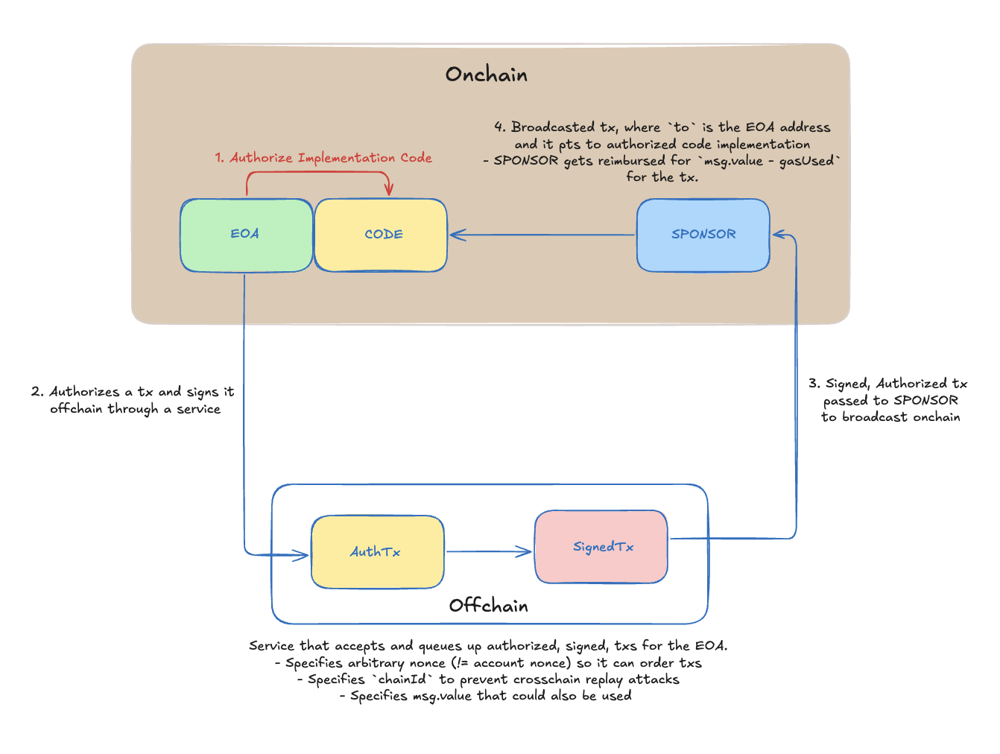

---
head:
  - - meta
    - property: og:title
      content: EIP-7702 Gas Sponsorship with Anvil
  - - meta
    - name: description
      content: Set up a quick demo showcasing gas sponsorship on an Anvil fork unlocked by EIP-7702
  - - meta
    - property: og:description
      content: Set up a quick demo showcasing gas sponsorship on an Anvil fork unlocked by EIP-7702
---

<script setup>
  import config from '@berachain/config/constants.json';
  import AddNetwork from '@berachain/ui/AddNetwork';
  import CopyToClipboard from '@berachain/ui/CopyToClipboard';
</script>

# EIP-7702 Gas Sponsorship with Anvil

<!-- TODO - figure out where to implement this as you have to rerun everything again: <!-- To run the anvil fork of Bepolia at the latest block: 

```bash
source .env && anvil --fork-url $BEPOLIA_RPC_URL --chain-id 80069 --hardfork prague --port 8545
``` --> -->

In this guide, we will walk you through a demo of gas sponsorship accomplished with EIP-7702, all on a local anvil fork. EIP-7702 is one of the improvement proposals implemented in the Bectra upgrade, on Bepolia, mirroring the changes made within Ethereum Mainnet with Pectra. 

Gas Sponsorship simply entails:
- An EOA authorizing an implementation contract at its own address
- Use of EIP-7702 transaction type, 0x04, to carry out transactions with this implementation logic
- The EOA signing an authorized transaction offchain and passing the details to a Sponsor to broadcast it to the chain, where the transaction `to` variable is actually the EOA itself

## Gas Sponsorship with EIP 7702 vs EIP 4337 and Pre-Signed Transactions

Before getting into the guide, it is important to highlight key distinctions between the alternative methods for gas sponsorship.  The three main options today include: 

- Pre-signed transactions with relayers
- EIP-4337 with account abstraction and a complex system
- EIP-7702 where an EOA acts like a smart account offering gas sponsorship methods

Pre-signed transactions with relayers are the simplest way to do gas sponsorship. The process simply includes the user signing something offchain, and a relayer sending the actual transaction onchain. It works, but it’s all custom, where the designer has to handle replay protection,  validation, and signatures manually. Since there is no standard format or infrastructure, implementation can get complicated. 

On the other hand, EIP-4337 takes things further with a full account abstraction system. There are aspects such as an EntryPoint contract, UserOperations, bundlers, paymasters, and more. The standard unlocks powerful features like sponsor-paid gas, batching, and smart account logic, but the tradeoff is high complexity and more infrastructure that doesn’t exist natively on Ethereum.

EIP-7702 is a newer option that offers more simplicity holistically. It lets an EOA act like a smart account. That means you get gas sponsorship and smart account behavior without needing complex infrastructure such as bundlers and more. The standard is protocol-native, easy to integrate, and flexible enough to cover most real-world use cases without the overhead of EIP-4337.

In comparison to the other two, EIP-7702 gives the designer and user the benefits of account abstraction; ie. smart logic, delegated signing, sponsor support, without reinventing the transaction process. It offers the benefits of EIP-4337 without custom mempools, complex validation flows, etc., whilst also offering simplicity like pre-signed transactions. In essence, it really is just a EVM-native, standardized method to delegate behavior in a transaction. It's an exciting design space that will open up with Pectra on the EVM, and Bectra on Bepolia.

## Gas Sponsorship Flow Diagram with EIP-7702
Gas Sponsorship with EIP-7702 is an interesting design space. We have gone ahead and made this simple "Part 1" where the main flow of carrying out a gas sponsorship is highlighted. We will publish more parts outlining:

- Gas Sponsorship with ERC20s, where the EOA authorizes a transaction that transfers ERC20 to the Sponsor as a payment for the Sponsor to cover the gas required for the transaction.
- Using on-chain checks to ensure that the signer of the contract is the EOA itself. This will use solidity scripts leveraging Foundry.

Today's main flow consists of the following architecture and flow shown in the below diagram. The steps highlighted in the schematic will be walked through in the code walk through.



:::tip
For further information on Bectra, make sure to follow our [berachaindevs twitter](https://x.com/berachaindevs) as we publish more content! 
:::

## Requirements

Before starting, ensure that you have carried out the following: 

- Install [Foundry](https://book.getfoundry.sh/getting-started/installation) `v1.0.0` or greater
- Clone the guides [repo](https://github.com/berachain/guides/tree/main) and make your way to the `apps/eip-7702-gas-sponsorship` directory to find the Gas Sponsorship Guide and associated code we'll walk through today.

# Guide Walk Through

Run all the commands within this guide while at the file path: `./apps/eip-7702-gas-sponsorship`.

## Step 1 - Setup

Install dependencies for the project:

   ```bash
   pnpm install
   ```

Set up environment variables:

   ```bash
   cp .env.example .env
   ```
There are already `anvil` test addresses and private keys there. For this guide, keep it as is until you have walked through everything. Afterwards, feel free to use your own of course for your own testing. 

Start `anvil` fork at hard fork prague:

```bash
anvil --hardfork prague --chain-id 80069 --port 8545
```

## Step 2 - Deploy the `SimpleDelegate.sol` Contract

Deploy the `SimpleDelegate.sol` contract and populate `.env` with contract address. This contract logic will be what is assigned to the `EOA` to leverage EIP-7702. The below bash code will automatically update the `.env` with the new `SimpleDelegate.sol` `CONTRACT_ADRESS`.

```bash
source .env && forge script script/Implementation.s.sol:SimpleDelegateScript \
  --rpc-url $TEST_RPC_URL \
  --private-key $EOA_PRIVATE_KEY \
  --broadcast -vvvv \
  | tee deployment.log && \
CONTRACT_ADDRESS=$(grep -Eo '0x[a-fA-F0-9]{40}' deployment.log | tail -n1) && \
sed -i '' "/^CONTRACT_ADDRESS=/d" .env && echo "CONTRACT_ADDRESS=$CONTRACT_ADDRESS" >> .env
```

## Step 3 - Get the Nonce to Use for the Authorized Transaction

As mentioned, gas sponsorship with EIP-7702 requires:
- The `SPONSOR` to actually send enough gas to cover the transaction in the broadcasted call.
- Onchain checks for replay attacks, including across different chains, is recommended as well.

The latter concern is covered in the next part of the Gas Sponsorship guide.

The implementation contract provided has a getter called `getNonceToUse()`. It is a simple function where you just pass the actual current EOA nonce to it as a param, and it will return a nonce that is ahead of the EOA nonce. The hope is to provide a nonce that is a good deal larger than the current EOA nonce so the "Service" can order transactions as needed without concern that the EOA will have done numerous transactions causing a pre-authorized transaction to become stale.

Get current EOA nonce, `EOA_NONCE`, and query contract for `getNonceToUse()`. The `.env` is updated with the value `EOA_NONCE`.

```bash
source .env && \
EOA_NONCE=$(cast nonce $EOA_ADDRESS --rpc-url $TEST_RPC_URL) && \
NONCE_TO_USE=$(cast call $CONTRACT_ADDRESS "getNonceToUse(uint256)(uint256)" $EOA_NONCE --rpc-url $TEST_RPC_URL) && \
sed -i '' "/^NONCE_TO_USE=/d" .env && echo "NONCE_TO_USE=$NONCE_TO_USE" >> .env
```

Double check that this nonce makes sense with what the current `EOA_NONCE`, it should be 10 less than `NONCE_TO_USE` that you'll see in your `.env`. You can do this with this cast call:

```bash
source .env && cast nonce $EOA_ADDRESS --rpc-url $TEST_RPC_URL
```

## Step 4 - Prepare the Offchain Transaction Details to be Broadcast

Now that you have the correct nonce to use in your `.env`, the next step is to use `sign-auth` to have the `EOA` authorize the transaction to be broadcast by the `SPONSOR`. 

The bash command provided does the following:

Obtains the output from the `cast wallet sign-auth` call, `AUTH_SIG`. This variable will be used when the `SPONSOR` broadcasts the `EOA`'s transaction as it specifies the details of the actual transaction, and has implicit proof within it that the transaction is signed by the EOA.

Then, it prepares callData that directly invokes the `execute()` function in the smart account logic, passing no inner call for now. This is enough to test sponsorship, nonce, and signature checks implicitly using `cast` and `-auth`.

Then it carries out the transaction using `cast send`, where the `to` is the `$EOA_ADDRESS`, and the `$AUTH_SIG` has been signed offchain by the `EOA_PK`. The call is being carried out by the `SPONSOR` though to pay the gas!

Logs are output afterwards showcasing the results, which will be expanding on more in the next step!

```bash
source .env && \

# ⛽ Capture balances before
EOA_BAL_BEFORE=$(cast balance $EOA_ADDRESS --rpc-url $TEST_RPC_URL) && \
SPONSOR_BAL_BEFORE=$(cast balance $SPONSOR_ADDRESS --rpc-url $TEST_RPC_URL) && \
echo "💰 EOA Balance Before:     $EOA_BAL_BEFORE wei" && \
echo "💸 Sponsor Balance Before: $SPONSOR_BAL_BEFORE wei" && \

# ✍️ Sign EOA authorization
AUTH_SIG=$(cast wallet sign-auth $CONTRACT_ADDRESS \
  --private-key $EOA_PRIVATE_KEY \
  --nonce $NONCE_TO_USE \
  --rpc-url $TEST_RPC_URL) && \

# 📦 Prepare calldata for `execute(...)`
CALLDATA=$(cast calldata "execute((bytes,address,uint256),address,uint256)" \
  "(0x,$CONTRACT_ADDRESS,0)" $SPONSOR_ADDRESS $NONCE_TO_USE) && \

# 🚀 Send the sponsored transaction
TX_HASH=$(cast send $EOA_ADDRESS "$CALLDATA" \
  --private-key $SPONSOR_PRIVATE_KEY \
  --auth "$AUTH_SIG" \
  --rpc-url $TEST_RPC_URL | grep -i 'transactionHash' | awk '{print $2}') && \

# 🧾 Retrieve gas used and cost
RECEIPT=$(cast receipt $TX_HASH --rpc-url $TEST_RPC_URL) && \
GAS_USED=$(echo "$RECEIPT" | grep gasUsed | awk '{print $2}') && \
GAS_PRICE=$(echo "$RECEIPT" | grep effectiveGasPrice | awk '{print $2}') && \
GAS_COST_WEI=$(echo "$GAS_USED * $GAS_PRICE" | bc) && \
GAS_COST_GWEI=$(echo "scale=9; $GAS_COST_WEI / 1000000000" | bc) && \

# 💰 Capture balances after
EOA_BAL_AFTER=$(cast balance $EOA_ADDRESS --rpc-url $TEST_RPC_URL) && \
SPONSOR_BAL_AFTER=$(cast balance $SPONSOR_ADDRESS --rpc-url $TEST_RPC_URL) && \

# 📉 Calculate deltas
EOA_DELTA=$(echo "$EOA_BAL_BEFORE - $EOA_BAL_AFTER" | bc) && \
SPONSOR_DELTA=$(echo "$SPONSOR_BAL_BEFORE - $SPONSOR_BAL_AFTER" | bc) && \

# 🧾 Output Results
echo "📦 Transaction Hash: $TX_HASH" && \
echo "🔍 To view the auth list, run:" && \
echo "source .env && cast tx $TX_HASH --rpc-url $TEST_RPC_URL" && \
echo "To view the receipt and ensure that the transaction was successful or not, run: " && \
echo "source .env && cast receipt $TX_HASH --rpc-url $TEST_RPC_URL" && \
echo "📜 Gas Used: $GAS_USED gas units" && \
echo "💸 Gas Cost: $GAS_COST_WEI wei (~$GAS_COST_GWEI gwei)" && \
echo "💰 EOA Balance After:     $EOA_BAL_AFTER wei" && \
echo "💸 Sponsor Balance After: $SPONSOR_BAL_AFTER wei" && \
echo "📉 EOA Δ:                  $(echo "$EOA_DELTA / 10^9" | bc) Gwei" && \
echo "📉 Sponsor Δ (gas):        $(echo "$SPONSOR_DELTA / 10^9" | bc) Gwei" && \

# 🔬 Gas sanity check
cast receipt $TX_HASH --rpc-url $TEST_RPC_URL | grep -E 'gasUsed|effectiveGasPrice' && \
echo "✅ If sponsor delta roughly equals gasUsed * effectiveGasPrice → gas was paid by SPONSOR."
```

The output should look like this:


## Step 5 - Assessing the Results

The output from running the last command will provide two `cast` commands to assess the results. If you prefer, just run the following commands though and copy and paste the transaction hash in accordingly.

1. To see the Authorization List and other details signifying that the EIP-7702 transaction was successful, run:

```bash
source .env && cast tx $TX_HASH --rpc-url $TEST_RPC_URL
```

Here you'll see the following:

_Using our example contract address to illustrate, you'll have a different one. Our contract address as seen in the previous screenshot is: 0x0DCd1Bf9A1b36cE34237eEaFef220932846BCD82_

Under authorization list, you should see the contract address:

```bash
authorizationList    [{"chainId":"0x138c5","address":"0x0dcd1bf9a1b36ce34237eeafef220932846bcd82","nonce":"0x18","yParity":"0x1","r":"0x5b9ac56625105f2b627f344470290bfa3e5c5b19075ee741f5eedeb3e7288db2","s":"0xaa0bf8139cd82e5de12d33b13c1199444c9bca7f60fa7d577fafc7ddd455511"}]
```

and the `to` specified should be the EOA address, and the `from` address should be the SPONSOR address. These will be the same for you too assuming you followed the guide and are using the anvil test wallets 1 and 2:

```bash
to                   0xf39Fd6e51aad88F6F4ce6aB8827279cffFb92266
from                 0x70997970C51812dc3A010C7d01b50e0d17dc79C8
```

2. To see the transaction receipt, run:

```bash
source .env && cast receipt $TX_HASH --rpc-url $TEST_RPC_URL
```

Here you can see the gasUsed, as well as that the transaction has successfully passed. 


Regarding the gas, we can do a check on how much gas was taken from the Sponsor, and how much was reimbursed. We do just that with the previous command you sent where gas logs were output, but of course take what we need and carry out comparisons.


The rough gas used matches the delta (gas spent) from the `SPONSOR` address, whereas the `EOA` has not spent any gas at all.
That's it! Congrats you've walked through a high level example of gas sponsorship using EIP-7702 and Foundry Cast. Feel free to add comments or suggestions on our `guides` repo or reach out via Discord.

# Part 2 - Using Foundry Solidity Scripts and Implementing EOA Signer Checks

The guide so far walked through the high level transaction flow when working with EIP-7702 to leverage gas sponsorship for an EOA. In this second part of the guide, we will cover the usage of Foundry Solidity Scripts and changes within the authorized implementation logic, `SimpleDelegatePart2.sol`. The below steps walk through each core lesson, and the commands to run the entire guide is in step # [](TODO GET LINK TO BELOW STEP).

The files used include:

- `SimpleDelegatePart2.sol` - An expansion on `SimpleDelegate.sol` contract where it showcases signer recovery, nonce management, and use of inner calls with calldata.
- `SimpleDelegatePart2.s.sol` - A solidity script that is used to enact deployment of the implementation contract, authorization of the implementation logic for the EOA as per EIP-7702, and the broadcast of the sponsored transaction from the `SPONSOR` on behalf of the `EOA`.

Make sure to set up your `.env` so you can broadcast properly to Bepolia. You will need to have $tBERA within your wallets that you are using for both the EOA and the SPONSOR. 

> If you need $tBERA, you can get some from our [faucet](TODO-GetLink), or contact us directly.

```
# YOUR OWN WALLET DETAILS FOR DEPLOYING TO ACTUAL NETWORKS
EOA_WALLET1_ADDRESS=
EOA_WALLET1_PK=
SPONSOR_WALLET2_ADDRESS=
SPONSOR_WALLET2_PK=
```

The files are ready to test and work with. Let's briefly walk through what is going on in each of them to help solidify key lessons.

## Step 1 - Signer Checks with EIP-7702

It is important to check that the authorized transaction is originally signed by the EOA. Changes have been made to the Part 1 `SimpleDelegate.sol` contract where:

- The address of the signer is recovered using the `call` information and the provided `signature`.

The SimpleDelegatePart2.s.sol script is very different from the script used in part 1. Instead of using `cast` calls to deploy and interact with the contract and accounts, the solidity script carries out all the steps within the code.

> `vm.signDelegation` and `vm.attachDelegation` are cheatcodes from Foundry that allow EOAs and Sponsors to carry out EIP-7702 transactions when broadcast to networks. Please note that within simulations, such as with `forge test` or where solidity scripts are ran but not broadcast, Foundry is still working to support EIP-7702 transactions in full. For this tutorial, we will simply test against a local anvil forked network or the network directly.

The main gotcha with the script code and the changed implementation code is that the implementation code checks if the recovered address, and thus the signer, is the EOA itself. Only then will it pass and allow the transaction to carry out. 

```solidity
...
        bytes32 digest = keccak256(
            abi.encodePacked(userCall.to, userCall.value, keccak256(userCall.data), sponsor, nonce)
        );
        address recovered = MessageHashUtils.toEthSignedMessageHash(digest).recover(signature);
        require(recovered == address(this), "Invalid signer");
```

Above is the core check that exposes a couple of things about EIP-7702. The `address(this)` value is actually the `EOA` in the context of the EIP-7702 transaction. Therefore, any call and transaction enacted through it, must be signed by the `EOA_PK` itself.

This check ensures that no malicious transactions are carried through.

## Step 2 - Replay Attacks Prevention via Nonce Management

Replay attacks can be prevented with EIP-7702 transactions by having proper checks within the authorized implementation logic. Essentially if there is no check for the nonce being used in the authorized transaction, it could be re-used, which of course is a huge attack vector.

Expanding on part 1, where the high level transaction flow was shown for Gas Sponsorship with EIP-7702, we now use the persistent storage of the EOA to our advantage and keep track of the arbitrary nonces used from the "service" preparing transactions signed by the EOA.

Recall that the EOA nonce is not the same as the nonce used in these checks. The nonce used in these checks correspond to the arbitrary nonce that the offchain service uses to prepare transactions signed by the EOA ultimately. One reason for these arbitrary nonces is to prevent replay attacks by marking the nonce as used within a mapping in the implementation logic itself.

> A key lesson here is that the storage of the EOA persists when it comes to using authorized implementation logic via EIP-7702. It can be transient as well. 
<!-- TODO - confirm the last bit here. -->

The changes made with respect to nonce management include:

- A mapping of nonces to bool values, signifying when a nonce has been used.
- Conditional logic that reverts if the mapping of the proposed transaction nonce shows that it is a used nonce already.

```solidity
...
    mapping(uint256 => bool) public nonceUsed; // Whether EOA nonce has been used or not
    error NonceAlreadyUsed();
    
...
    function execute(
        Call memory userCall,
        address sponsor,
        uint256 nonce,
        bytes calldata signature
    ) external payable {

    ...
        if (nonceUsed[nonce]) revert NonceAlreadyUsed();
        nonceUsed[nonce] = true;
    ...
    }

```

## Step 3 - Crosschain Replay Attack Prevention via ChainID Management

Crosschain replay attacks occur when an authorized, signed, transaction is replayed on a separate network then from where it originated. This exposes risks to funds on different networks, and more. 

ChainIDs are used in the implementation logic as a way to prevent these crosschain attacks. Combined with the nonce mapping mentioned before, chainIDs can be used to ensure the transaction can only occur once on the specified network, and no where else.

<!-- TODO - add code snippit showing chainID management in implementation code -->

```solidity
...
    mapping(uint256 => bool) public nonceUsed; // Whether EOA nonce has been used or not
    error NonceAlreadyUsed();
    
...
    function execute(
        Call memory userCall,
        address sponsor,
        uint256 nonce,
        bytes calldata signature
    ) external payable {

    ...
        if (nonceUsed[nonce]) revert NonceAlreadyUsed();
        nonceUsed[nonce] = true;
    ...
    }

```

## Step 4 - Using Actual calldata via `burnNative()` with EIP-7702 Calls

Within the first part of this guide, we sent empty `calldata` to focus in on the use of EIP-7702 for gas sponsorship. Typically, transactions will not have empty calldata. An additional expansion for part 2 of this guide is to include a `burnNative()` function to showcase the execution of an internal call within the authorized transaction. 

It is key to understand that `msg.sender` in the internal call is the `tx.origin` which would be the `EOA`!

<!-- TODO - finish writing about the burn call -->

```bash
SimpleDelegatePart2.Call memory call = SimpleDelegatePart2.Call({
            to: EOA,
            value: burnAmount,
            data: abi.encodeWithSelector(simpleDelegate.burnNative.selector)
        });

        bytes32 digest = keccak256(
            abi.encodePacked(block.chainid, call.to, call.value, keccak256(call.data), SPONSOR, nonce)
        );
        bytes32 ethSigned = MessageHashUtils.toEthSignedMessageHash(digest);
        (uint8 v, bytes32 r, bytes32 s) = vm.sign(EOA_PK, ethSigned);
        bytes memory signature = abi.encodePacked(r, s, v);


        uint256 sponsorBefore = SPONSOR.balance;
        uint256 eoaBefore = EOA.balance;

        vm.startBroadcast(SPONSOR_PK);
        vm.attachDelegation(signedDelegation);

        bytes memory code = address(EOA).code;
        require(code.length > 0, "no code written to EOA");

        (bool success, ) = EOA.call{value: transferAmount}(
            abi.encodeWithSelector(
                SimpleDelegatePart2.execute.selector,
                call,
                SPONSOR,
                nonce,
                signature
            )
        );
        require(success, "Call to EOA smart account failed");

        vm.stopBroadcast();

```

### Step 5 - Understanding and Running the Solidity Script

We have discussed the changes made to the implementation logic in `SimpleDelegatePart2.sol`. Now we will walk through the main components within the Solidity Script.

Instead of piecing things together with `cast`, we use a full Foundry Solidity script to handle everything: deployment, delegation, authorization, broadcasting, and even checking for replay and signature mismatches. This is a great way to simulate what a service or wallet might actually do when working with EIP-7702.

Using a Foundry Solidity script gives you a lot:

- You get full control over both the EOA and the sponsor inside one flow
- Cheatcodes like `vm.sign`, `vm.envAddress`, `vm.startBroadcast` make this super clean
- You can easily simulate replay, forged signatures, chain ID mismatches
- You can inspect balances, gas deltas, and storage at the EOA address directly

The file is `SimpleDelegatePart2.s.sol`, and the main entry point is the `SimpleDelegate2Script` contract. You can run it using:

```bash
source .env && forge script script/SimpleDelegatePart2.s.sol:SimpleDelegate2Script \
  --rpc-url $TEST_RPC_URL \
  --broadcast -vvvv
```

This script works on a local anvil fork or Bepolia. As mentioned before, just make sure your `.env` has the right test keys and enough $tBERA.

#### What the Script Does

The Solidity script does the entire 7702 lifecycle in one flow:

1. Deploys the `SimpleDelegatePart2` contract
2. Signs a delegation from the EOA to itself
3. Constructs a call to `burnNative()` using the implementation logic
4. Signs the transaction offchain using the EOA private key
5. Has the sponsor broadcast the transaction using `execute(...)`
6. Logs balances, costs, and verifies the result

This is a pretty accurate simulation of how things would work in practice with a wallet frontend, sponsor backend, and protocol logic.

We also run two important tests mentioned before:

- **Replay attack**: Try sending the same tx again → should revert due to `nonceUsed[nonce]` being true.
- **Cross-chain replay**: Try a forged signature using the wrong chain ID → should fail signature recovery.

### Core Lessons in the Script

There are a few key things this script shows:

- `address(this)` inside the implementation contract equals the EOA, since EIP-7702 executes the logic at the EOA's address
- Storage writes like `nonceUsed[nonce] = true` persist at the EOA
- Including `block.chainid` in the digest ensures signatures only work on the intended chain

All of these are things are highly recommended to get right in a production deployment of EIP-7702 sponsorship flows.

### Step 6 - Assessing the New Final Results

The contract has been successfully interacted with at the EOA's address by observing the following:

Below you can see the `to` address is the EOA, the `from` address is the SPONSOR, and the implementation address is seen under the `authorizationList`.

```json
{
      "hash": "0x131051742f94c2fb10422d53d134a78deb41404dd5b47e99cff721dc4eb70b02",
      "transactionType": "CALL",
      "contractName": null,
      "contractAddress": "0x63e6ab65010c695805a3049546ef71e4a242eb6c",
      "function": "execute((bytes,address,uint256),address,uint256,bytes)",
      "arguments": [
        "(0xfbc7c433, 0x63E6ab65010C695805a3049546EF71e4A242EB6C, 10000000000000000)",
        "0x00195EFB66D39809EcE9AaBDa38172A5e603C0dE",
        "17",
        "0xbb7f5ba622d818bb258263974aaa2131dd1dda771c78f88b89152d6b432cfbfe3d02237565c005bb0e6811de03311210e04ec7224d262b2bf7c764b66ce4aff41b"
      ],
      "transaction": {
        "from": "0x00195efb66d39809ece9aabda38172a5e603c0de",
        "to": "0x63e6ab65010c695805a3049546ef71e4a242eb6c",
        "gas": "0x2a7d1",
        "value": "0x6a94d74f430000",
        "input": "0xd65fcb6c000000000000000000000000000000000000000000000000000000000000008000000000000000000000000000195efb66d39809ece9aabda38172a5e603c0de00000000000000000000000000000000000000000000000000000000000000110000000000000000000000000000000000000000000000000000000000000120000000000000000000000000000000000000000000000000000000000000006000000000000000000000000063e6ab65010c695805a3049546ef71e4a242eb6c000000000000000000000000000000000000000000000000002386f26fc100000000000000000000000000000000000000000000000000000000000000000004fbc7c433000000000000000000000000000000000000000000000000000000000000000000000000000000000000000000000000000000000000000000000041bb7f5ba622d818bb258263974aaa2131dd1dda771c78f88b89152d6b432cfbfe3d02237565c005bb0e6811de03311210e04ec7224d262b2bf7c764b66ce4aff41b00000000000000000000000000000000000000000000000000000000000000",
        "nonce": "0x2",
        "chainId": "0x138c5",
        "authorizationList": [
          {
            "chainId": "0x138c5",
            "address": "0xddb11edb9498e778d783e1514519631db978cefe",
            "nonce": "0x7",
            "yParity": "0x1",
            "r": "0xd304ce7ae24007d5f367dd397030c92686c7a10180c8094825736854a96be633",
            "s": "0x1c304881690f634b1a2f9192137097d0e7e37d27538353f26446368925e0c2e5"
          }
        ]
      },
      "additionalContracts": [],
      "isFixedGasLimit": false
    }
```

The output will showcase a successful transaction and a reversion for both `NonceAlreadyUsed()` and `Invalid Signer`.

```bash
[⠊] Compiling...
No files changed, compilation skipped
Warning: Detected artifacts built from source files that no longer exist. Run `forge clean` to make sure builds are in sync w
ith project files.                                                                                                            - /Users/ichiraku/Documents/1-CODE/2-Guides/May-22/guides/apps/eip-7702-gas-sponsorship/script/SimpleDelegatePart2RealDeploy
ment.s.sol                                                                                                                   Warning: EIP-3855 is not supported in one or more of the RPCs used.
Unsupported Chain IDs: 80069.
Contracts deployed with a Solidity version equal or higher than 0.8.20 might not work properly.
For more information, please see https://eips.ethereum.org/EIPS/eip-3855
Script ran successfully.

== Logs ==
  Sponsor balance (wei): 19992485519997369932
  ---- Execution Summary ----
  Sponsor Gas Spent (wei): 996420000348747
  EOA Delta (wei): 0
  Amount reimbursed to Sponsor (wei): 29003579999651253
  ---- Test Case 1: Replay with Same Nonce ----
  Replay failed as expected (nonce already used).
  ---- Test Case 2: Replay with Wrong ChainID ----
  Cross-chain replay failed as expected (invalid chainId in signature).

## Setting up 1 EVM.
  [12323] 0x63E6ab65010C695805a3049546EF71e4A242EB6C::execute{value: 30000000000000000}(Call({ data: 0xfbc7c433, to: 0x63E6ab
65010C695805a3049546EF71e4A242EB6C, value: 10000000000000000 [1e16] }), 0x00195EFB66D39809EcE9AaBDa38172A5e603C0dE, 19, 0x91f3ff0d4999ce2d97ad98d9c78c967e30a17e313941763f726f943d122d6f6d24d01b00050c9cf12c2a060a22c012d70787d07a174b87187b6cd083cc24b59e1b)                                                                                                                              ├─ [3000] PRECOMPILES::ecrecover(0xbaf222251f89c11d41a500b7a405321c85d41d2cbc0a926cdb39d802150a979c, 27, 6601646718486358
1129492900441135972292030061417493464943343716828623890378605, 16650953086154607435429330488942928347914477230191894192328024569607478359454) [staticcall]                                                                                                    │   └─ ← [Return] 0x00000000000000000000000063e6ab65010c695805a3049546ef71e4a242eb6c
    └─ ← [Revert] NonceAlreadyUsed()

  [10049] 0x63E6ab65010C695805a3049546EF71e4A242EB6C::execute{value: 30000000000000000}(Call({ data: 0xfbc7c433, to: 0x63E6ab
65010C695805a3049546EF71e4A242EB6C, value: 10000000000000000 [1e16] }), 0x00195EFB66D39809EcE9AaBDa38172A5e603C0dE, 19, 0x90574dcdf09f26952729cdbede854d50a10d377fb224970f2eb38654c8627f34293347fdd28a3d4396dbd9f7f80f157cc930a6c5b221efd916fb7441614e294d1c)                                                                                                                              ├─ [3000] PRECOMPILES::ecrecover(0xbaf222251f89c11d41a500b7a405321c85d41d2cbc0a926cdb39d802150a979c, 28, 6528730287722426
9808226580710698351715294006742266363989773667897382331907892, 18635432859247198048365968425627914393284181918472378048396876387465699404109) [staticcall]                                                                                                    │   └─ ← [Return] 0x0000000000000000000000001191ad406538b598920074e2197cbe682dc0f449
    └─ ← [Revert] Invalid signer

Error: Simulated execution failed.
```

<!-- TODO - get code snippit of the successful tx of the gas reimbursement and sponsorship and burn -->

Finally, we have walked through the second part of gas sponsorship. Congrats! In the next gas-sponsorship guide expansion, we will walk through support for ERC20 payment flows. 
