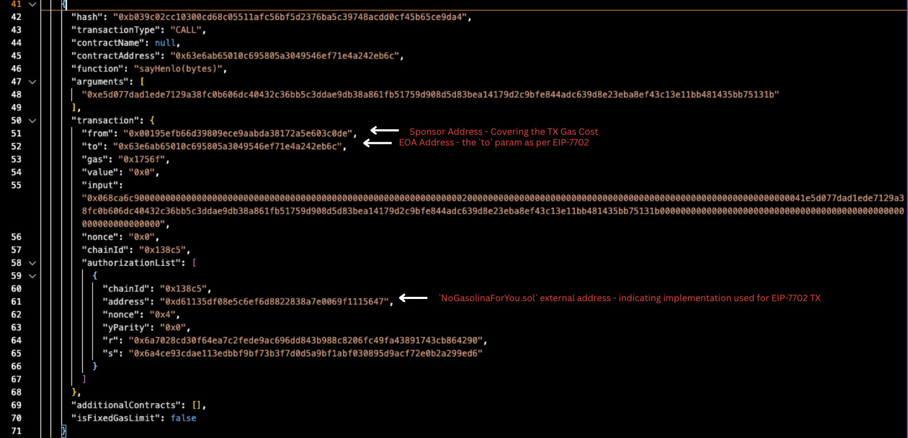

---
head:
  - - meta
    - property: og:title
      content: EIP-7702 Gas Sponsorship with Bepolia
  - - meta
    - name: description
      content: Set up a quick demo showcasing gas sponsorship on Bepolia unlocked by EIP-7702
  - - meta
    - property: og:description
      content: Set up a quick demo showcasing gas sponsorship on Bepolia unlocked by EIP-7702
---

<script setup>
  import config from '@berachain/config/constants.json';
  import AddNetwork from '@berachain/ui/AddNetwork';
  import CopyToClipboard from '@berachain/ui/CopyToClipboard';
</script>

# EIP-7702 Gas Sponsorship with Bepolia

In this guide, we will walk you through a demo of gas sponsorship on the Bepolia testnet accomplished with EIP-7702. EIP-7702 is one of the improvement proposals implemented in the Bectra upgrade, on Bepolia, mirroring the changes made within Ethereum Mainnet with Pectra. The goal is to provide a rough example on how to leverage gas sponsorship for your own dApp.

:::tip
For further information on Bectra, see our breakdowns [here](TODO-GetLinksToBectraContextBlogs).
:::

## Requirements

Before starting, ensure that you have carried out the following: 

- Read the [high-level thread on EIP-7702 and this guide](https://typefully.com/t/eXTS8ND) for a high-level understanding on key gotchas.
- [Foundry](https://book.getfoundry.sh/getting-started/installation) `v1.0.0` or greater
- Clone the guides [repo](https://github.com/berachain/guides/tree/main) and make your way to the `apps/7702-Gas-Sponsorship` directory to find the Gas Sponsorship Guide and associated code we'll walk through today.

## Important Overview Notes on EIP-7702

Having read the [thread](https://typefully.com/t/eXTS8ND), we'll only touch on a few things before jumping into the code itself.

### The Anatomy of an EIP-7702 Transaction

Recall that typical EVM transactions either transfer funds or work with smart contracts. The new `0x04` transaction type provides EOAs with the ability to execute code directly. Basically, EOAs now have can function more like smart contracts.

**Typical EVM Account Types**

- EOAs: These are controlled by a private key, and hold funds. They do not have the ability to run code.
- Smart Contract Accounts: They can hold and carry out code, executing complex operations.

There are a couple of key steps when it comes to working with EIP-7702 transactions:

1. Signing Authorization - the EOA generates a signed authorization that nesures only the approved implementation contract can execute transactions for it. So basically when the user (or a sponsor) executes an EIP-7702 transaction, it will load and run the code from the address that is authorized by the EOA.

2. Transaction Construction - With EIP-7702, the `to` field is set to the EOA's address and includes the `data` to call the implementation contract's function(s) with the signed authorization message. This is atypical compared to usual EVM transactions where a function call to a smart contract has the `to` field set to the contract's address with `data` to call its function.

> **If another wallet (sponsor) chooses to execute this respective transaction, it simply uses the same authorization signature and delegates execution to the imiplementation contract.**

### The Typical Flow of an EIP-7702 Transaction

Below is the typical flow of working with an EIP-7702 Transaction to provide more details:

1. Generate an authorization signature for a specific contract.
2. Construct a transaction where the `to` field is set to the smart account's address.
3. The `data` field is created by encoding a call to the respective implementation function call. See the callout below.

> Recall that a digest, or a hash, is what is signed by an EOA to authorize a specific action. So within this guide, the EOA signs a digest to call `henlo.sayHenlo()` but it is being called indirectly through the `NoGasolinaForYou.sol` contract as this contract is an example of a separate `implementation` contract that works hand-in-hand with a dApp (in this case, the `henlo` contract). **It's kind of like imagining having a Uniswap DEX Pool, and having it so the protocol wants to enable EIP-7702 transactions (for gas sponsorship, batch transactions etc.). They could make an implementation contract that acts as a trusted and verified router to their core contracts that Smart Accounts could leverage (authorize).**

### Implementation Contract Design Practice

Implementation contracts carry the same, if not more, risk than traditional smart contracts. It is key to carry forward good, typical smart contract design practices when writing these. Within this guide, we have created a implementation contract `NoGasolinaForYou.sol` that has guard-railed function calls to the `Henlo.sol` contract. In comparison, other example contracts have outlined low level calls such that any transaction could arguably carried out.

## Guide Walk Through

Now that you have a refresher understanding of EIP-7702, we'll walk you through running the guide first. We'll follow that with explanations on the components more in detail. 

### Guide Overview

This guide deploys an implementation contract called `NoGasolinaForYou.sol` meant to exemplify and enable:

- **Smart Accounts:** The use of an implementation contract that is authorized by an `EOA`
- **Sponsored Transactions:** Allowing a `Sponsor` to pay for gas fees for a transaction signed by the `EOA`.
- **Guard-Railed Implementation Contract Design:** Having an implementation contract that is bespoke to a specific underlying smart contract, `Henlo.sol`, to exemplify creating logic that does not have a wide range of attack surface, such as using low level calls within the implementation logic.
- **Replay Protection:** The use of nonces to prevent transaction replay within the implementation logic.

The high-level components and flow of this guide include:

<!-- TODO: add a quick excalidraw or eraser.io sequence diagram -->

**Components:**
- `Henlo.sol` contract that simply emits an event stating "Henlo Ooga Booga"
- `NoGasolinaForYou.sol` contract acting as an example implementation contract representing "guard-railed" transactions with gas sponsorship leveraging EIP-7702
- `SponsorSayHenlo.s.sol` solidity script to deploy the `Henlo.sol`, `NoGasolinaForYou.sol`, and carry out EIP-7702 txs showcasing gas sponsorship with the latter.
- `NoGasolinaForYou.t.sol` test contract providing local foundry tests to highlight EIP-7702 within foundry limitations.

**Guide Flow:**
- The deployment of `Henlo.sol` and then `SponsorSayHenlo.sol`, where the latter requires the `Henlo.sol` external address.
- `NoGasolinaForYou.sol` used as the implementation logic that the EOA will authorize as a delegate address. AKA the EOA will use the contract logic that is at the external address of `NoGasolinaForYou.sol`, but it will use the address, storage and details of the EOA.
<!-- TODO: confirm the last bit of the above -->
- The `SponsorSayHenlo.s.sol` foundry script, after deploying the two contracts above, leverages EIP-7702 and:
  - Designates the `NoGasolinaForYou.sol` implementation logic as the authorized delegate address for the EOA.
  - Prepares the tx details as if from the EOA.
  - The gas sponsor broadcasts the tx, and thus pays the gas on the tx that was originally signed by the EOA.
- Additional `NoGasolinaForYou.t.sol` test contract providing local foundry tests to highlight EIP-7702 within foundry limitations.

> To see the true gas expenditure as it should be leveraging EIP-7702, where the Sponsor properly pays for the tx on behalf of the EOA, the script must be ran on the actual network, Bepolia. **Gas expenditure is not properly showcased within foundry tests or on anvil forks**

### Step 1 - Setup

Clone the guides [repo](https://github.com/berachain/guides/tree/main) and make your way to the `apps/7702-Gas-Sponsorship` directory to find the Gas Sponsorship Guide and associated code we'll walk through today. You can do this by running:

`git clone https://github.com/berachain/guides.git && cd apps/eip-7702-gas-sponsorship`

Install dependencies:

`pnpm install`

Set up environment variables:

`cp .env.example .env`

and populate the vars accordingly. Make sure to have some tBERA in both the EOA and SPONSOR wallets.

> If you need $tBERA, simply reach out and we can send you a small amount or go to the faucet!

Make sure you have Foundry installed on your machine. If you have not installed it, run the following command:

`curl -L https://foundry.paradigm.xyz | bash`

Check the [foundry docs](https://book.getfoundry.sh/) for more information if you are newer to Foundry.

### Step 2 - Run the Solidity Script

Since everything is already prepared within the repo, the next step is to simply deploy the contracts mentioned and carry out an EIP-7702 transaction showcasing the gas sponsorship!

Details of the code used throughout the repo have natspec within them outlining their core functionalities.

To run the script, make sure you have your `.env` populated with the appropriate wallet details. 

Run:

```
source .env && forge script script/SponsorSayHenlo.s.sol:SponsorSayHenlo --rpc-url $BEPOLIA_RPC_URL --with-gas-price 25000000000 --slow --broadcast
```

The transaction will prompt you to continue, y/n, hit y. Traditionally, EOAs do not have any on-chain code, so this is a warning prompt expected before EIP-7702 was implemented. 

The transaction should successfully be carried out now, and the transaction results can be dissected within the `broadcast/SponsorSayHenlo.s.sol/run-latest.json` file. See below for more details outlining how we know the transaction carried through properly.

### Dissecting the `run-latest.json` Results

The CLI output from running the script displays the three transactions being carried out.

1. Deployment of the `Henlo.sol` contract
2. Deployment of the `NoGasolinaForYou.sol` contract
3. EIP-7702 call broadcasted by the `Sponsor` for the `EOA`, where `EOA` is the `to` param within the transaction.

We can look at the saved transactions to expand on the EIP-7702 transactions. The sponsored execution transaction is shown below. Key points outlined within the `run-latest.json` page.

- The `Sponsor` address is the sender, while the `EOA` is the contract address.
- The `authorizationList`, a component of EIP-7702 transactions, contains the signed authorization, and we can see that the external address that is pointed to for the  implementation logic for `NoGasolinaForYou.sol` is included.
- The `Sponsor` is broadcasting the transaction for the EOA, and thus is paying for the gas of the transaction.



<!-- Part of the Guide that needs to be flushed out -->

## Guide Code Details

TODO

### How does it compare to pre-signed transactions with relayers and userOps with AA

TODO

<!-- TODO: Consolidate rough notes with proper research and references. -->
<!-- 
<details>
<summary>Rough notes:</summary>


Why EIP 7702
- You want immediate EOA compatibility, ok with trusted relayers, and want quick and simple gasless flows.
- Minimial infrastructure overhead
    - Use of Bepolia's native transaction features where it is fully compatible with existing RPC stacks, tools, and block explorers.
    - If you're a project that wants AA without running or depending on 3rd party infra.
- Maintains EOA compatibility
    - Outside of the 7702 tx, accounts remain EOAs. This allows for interoperability with legacy contracts.
    - Fallback to ECDSA signing
    - Avoids lock-in to smart wallet (4337) architecture
    - This means it's ideal for offering opt-in abstraction with minimal change to user key management
- Lower cost of entry for gas sponsorship
    - 1-off promotions, airdrops, or specific transactions dApps can add logic inline in the 7702 tx to see if user is sponsored
    - Operate without maintaining a full paymaster contract -- basically offers a solution where 4337 is overkill
- Off-The-Shelf batching of txs paired with this low-overhead gas sponsorship is powerful.

Why pre-signed transactions:
- Pre-Signed txs: Fully formed EVM tx, signed off-chain by the user (an EOA typically) and submitted via third-party relayer that pays the gas but the tx appears on-chain as if sent by the user directly.
- Basically the relayer wraps and broadcasts signed tx to public mempool.
- Fully compatible with legacy infra and wallets; no reliance on 4337 smart accounts or 7702 tx formatting
- Uses standard EOA tx format and eth_sendRawTransaction.
- Ideal for: 
    - Hackathons, MVPs, airdrops, “connect + mint” flows.
    - Projects okay with centralized relayers (e.g., gaming, promotions, custodial flows).

BUT
- Requires full trust in the relayer who could
    - refuse to broadcast
    - front-run or modify the tx
    - delay submission
    - there is no on-chain enforcement of gas sponsorship rules
- Lacks flexibility
    - Cannot enforce per-user, per-action sponsorship transparently
    - Cannot scale or decentralize gas abstraction

Why 4337 with paymasters (TODO - research 4337 more)
- Fully programmable and trustless sponsorship
    - On-chain Paymasters enables: usage-based sponsorship, conditional gas payements, and more. They are transparent, auditable and enforceable.
    - Ideal for decentralized systems relying on off-chain trust or manual sponsor verification.
- Smart account extensibility
    - Logic is persistent. This is the big difference. Thus this enables:
        - Social recovery, session keys, signature plugins
    - Upgradeable wallets and modular design is possible.
    - Ideal for long term wllet UX design, DAO wallets, and programmable user IDs
- Scalable tx abstraction:
    - `UserOperation` abstraction enables tx batching, atomic execution and gas optimization across users (bundlers)
    - Sponsorship is scalable and automated
    - Ideal for high-volume apps that need abstraction at scale.

tldr;

**Choose Pre-signed tx + relayers when:**

- You want immediate EOA compatibility
- You’re okay with trusted relayers
- You want quick, simple gasless flows

**Choose EIP-7702 when:**

- You want a balance: some smart logic, no infra overhead
- You want to batch calls or simulate smart wallets without migrating
- You're optimizing lightweight UX flows

**Choose EIP-4337 when:**

- You want trustless, programmable gas abstraction
- You’re building persistent smart accounts
- You’re investing in long-term UX abstraction and infra
</details> -->