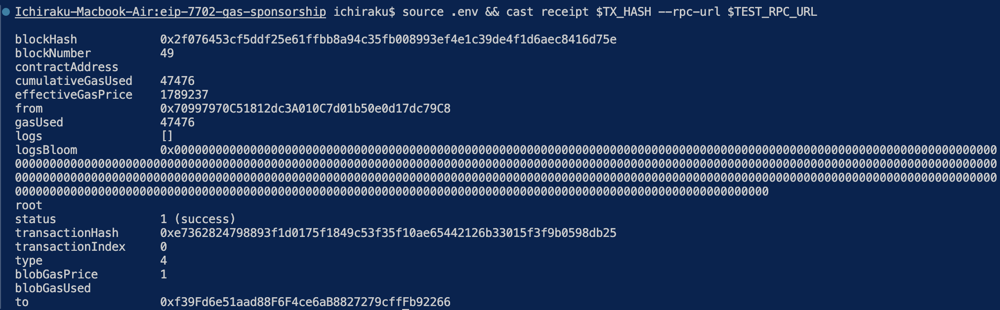

---
head:
  - - meta
    - property: og:title
      content: EIP-7702 Gas Sponsorship with Anvil
  - - meta
    - name: description
      content: Set up a quick demo showcasing gas sponsorship on an Anvil fork unlocked by EIP-7702
  - - meta
    - property: og:description
      content: Set up a quick demo showcasing gas sponsorship on an Anvil fork unlocked by EIP-7702
---

<script setup>
  import config from '@berachain/config/constants.json';
  import AddNetwork from '@berachain/ui/AddNetwork';
  import CopyToClipboard from '@berachain/ui/CopyToClipboard';
</script>

# EIP-7702 Gas Sponsorship with Anvil

In this guide, we will walk you through a demo of gas sponsorship accomplished with EIP-7702, all on a local anvil fork. EIP-7702 is one of the improvement proposals implemented in the Bectra upgrade, on Bepolia, mirroring the changes made within Ethereum Mainnet with Pectra. 

Gas Sponsorship simply entails:
- An EOA authorizing an implementation contract at its own address
- Use of EIP-7702 transaction type, 0x04, to carry out transactions with this implementation logic
- The EOA signing an authorized transaction offchain and passing the details to a Sponsor to broadcast it to the chain, where the transaction `to` variable is actually the EOA itself

## Gas Sponsorship with EIP 7702 vs EIP 4337 and Pre-Signed Transactions

Before getting into the guide, it is important to highlight key distinctions between the alternative methods for gas sponsorship.  The three main options today include: 

- Pre-signed transactions with relayers
- EIP-4337 with account abstraction and a complex system
- EIP-7702 where an EOA acts like a smart account offering gas sponsorship methods

Pre-signed transactions with relayers are the simplest way to do gas sponsorship. The process simply includes the user signing something offchain, and a relayer sending the actual transaction onchain. It works, but it’s all custom, where the designer has to handle replay protection,  validation, and signatures manually. Since there is no standard format or infrastructure, implementation can get complicated. 

On the other hand, EIP-4337 takes things further with a full account abstraction system. There are aspects such as an EntryPoint contract, UserOperations, bundlers, paymasters, and more. The standard unlocks powerful features like sponsor-paid gas, batching, and smart account logic, but the tradeoff is high complexity and more infrastructure that doesn’t exist natively on Ethereum.

EIP-7702 is a newer option that offers more simplicity holistically. It lets an EOA act like a smart account. That means you get gas sponsorship and smart account behavior without needing complex infrastructure such as bundlers and more. The standard is protocol-native, easy to integrate, and flexible enough to cover most real-world use cases without the overhead of EIP-4337.

In comparison to the other two, EIP-7702 gives the designer and user the benefits of account abstraction; ie. smart logic, delegated signing, sponsor support, without reinventing the transaction process. It offers the benefits of EIP-4337 without custom mempools, complex validation flows, etc., whilst also offering simplicity like pre-signed transactions. In essence, it really is just a EVM-native, standardized method to delegate behavior in a transaction. It's an exciting design space that will open up with Pectra on the EVM, and Bectra on Bepolia.

## Gas Sponsorship Flow Diagram with EIP-7702
Gas Sponsorship with EIP-7702 is an interesting design space. We have gone ahead and made this simple "Part 1" where the main flow of carrying out a gas sponsorship is highlighted. We will publish more parts outlining:

- Gas Sponsorship with ERC20s, where the EOA authorizes a transaction that transfers ERC20 to the Sponsor as a payment for the Sponsor to cover the gas required for the transaction.
- Using on-chain checks to ensure that the signer of the contract is the EOA itself. This will use solidity scripts leveraging Foundry.

Today's main flow consists of the following architecture and flow shown in the below diagram. The steps highlighted in the schematic will be walked through in the code walk through.


:::tip
For further information on Bectra, make sure to follow our [berachaindevs twitter](https://x.com/berachaindevs) as we publish more content! 
:::

## Requirements

Before starting, ensure that you have carried out the following: 

- Install [Foundry](https://book.getfoundry.sh/getting-started/installation) `v1.0.0` or greater
- Clone the guides [repo](https://github.com/berachain/guides/tree/main) and make your way to the `apps/eip-7702-gas-sponsorship` directory to find the Gas Sponsorship Guide and associated code we'll walk through today.

# Guide Walk Through

Run all the commands within this guide while at the file path: `./apps/eip-7702-gas-sponsorship`.

## Step 1 - Setup

Install dependencies for the project:

   ```bash
   pnpm install
   ```

Set up environment variables:

   ```bash
   cp .env.example .env
   ```
There are already `anvil` test addresses and private keys there. For this guide, keep it as is until you have walked through everything. Afterwards, feel free to use your own of course for your own testing. 

Start `anvil` fork at hard fork prague:

```bash
anvil --hardfork prague --chain-id 80069 --port 8545
```

## Step 2 - Deploy the `SimpleDelegate.sol` Contract

Deploy the `SimpleDelegate.sol` contract and populate `.env` with contract address. This contract logic will be what is assigned to the `EOA` to leverage EIP-7702. The below bash code will automatically update the `.env` with the new `SimpleDelegate.sol` `CONTRACT_ADRESS`.

```bash
source .env && forge script script/Implementation.s.sol:SimpleDelegateScript \
  --rpc-url $TEST_RPC_URL \
  --private-key $EOA_PRIVATE_KEY \
  --broadcast -vvvv \
  | tee deployment.log && \
CONTRACT_ADDRESS=$(grep -Eo '0x[a-fA-F0-9]{40}' deployment.log | tail -n1) && \
sed -i '' "/^CONTRACT_ADDRESS=/d" .env && echo "CONTRACT_ADDRESS=$CONTRACT_ADDRESS" >> .env
```

## Step 3 - Get the Nonce to Use for the Authorized Transaction

As mentioned, gas sponsorship with EIP-7702 requires:
- The `SPONSOR` to actually send enough gas to cover the transaction in the broadcasted call.
- Onchain checks for replay attacks, including across different chains, is recommended as well.

The latter concern is covered in the next part of the Gas Sponsorship guide.

The implementation contract provided has a getter called `getNonceToUse()`. It is a simple function where you just pass the actual current EOA nonce to it as a param, and it will return a nonce that is ahead of the EOA nonce. The hope is to provide a nonce that is a good deal larger than the current EOA nonce so the "Service" can order transactions as needed without concern that the EOA will have done numerous transactions causing a pre-authorized transaction to become stale.

Get current EOA nonce, `EOA_NONCE`, and query contract for `getNonceToUse()`. The `.env` is updated with the value `EOA_NONCE`.

```bash
source .env && \
EOA_NONCE=$(cast nonce $EOA_ADDRESS --rpc-url $TEST_RPC_URL) && \
NONCE_TO_USE=$(cast call $CONTRACT_ADDRESS "getNonceToUse(uint256)(uint256)" $EOA_NONCE --rpc-url $TEST_RPC_URL) && \
sed -i '' "/^NONCE_TO_USE=/d" .env && echo "NONCE_TO_USE=$NONCE_TO_USE" >> .env
```

Double check that this nonce makes sense with what the current `EOA_NONCE`, it should be 10 less than `NONCE_TO_USE` that you'll see in your `.env`. You can do this with this cast call:

```bash
source .env && cast nonce $EOA_ADDRESS --rpc-url $TEST_RPC_URL
```

## Step 4 - Prepare the Offchain Transaction Details to be Broadcast

Now that you have the correct nonce to use in your `.env`, the next step is to use `sign-auth` to have the `EOA` authorize the transaction to be broadcast by the `SPONSOR`. 

The bash command provided does the following:

Obtains the output from the `cast wallet sign-auth` call, `AUTH_SIG`. This variable will be used when the `SPONSOR` broadcasts the `EOA`'s transaction as it specifies the details of the actual transaction, and has implicit proof within it that the transaction is signed by the EOA.

Then, it prepares callData that directly invokes the `execute()` function in the smart account logic, passing no inner call for now. This is enough to test sponsorship, nonce, and signature checks implicitly using `cast` and `-auth`.

Then it carries out the transaction using `cast send`, where the `to` is the `$EOA_ADDRESS`, and the `$AUTH_SIG` has been signed offchain by the `EOA_PK`. The call is being carried out by the `SPONSOR` though to pay the gas!

Logs are output afterwards showcasing the results, which will be expanding on more in the next step!

```bash
source .env && \

# ⛽ Capture balances before
EOA_BAL_BEFORE=$(cast balance $EOA_ADDRESS --rpc-url $TEST_RPC_URL) && \
SPONSOR_BAL_BEFORE=$(cast balance $SPONSOR_ADDRESS --rpc-url $TEST_RPC_URL) && \
echo "💰 EOA Balance Before:     $EOA_BAL_BEFORE wei" && \
echo "💸 Sponsor Balance Before: $SPONSOR_BAL_BEFORE wei" && \

# ✍️ Sign EOA authorization
AUTH_SIG=$(cast wallet sign-auth $CONTRACT_ADDRESS \
  --private-key $EOA_PRIVATE_KEY \
  --nonce $NONCE_TO_USE \
  --rpc-url $TEST_RPC_URL) && \

# 📦 Prepare calldata for `execute(...)`
CALLDATA=$(cast calldata "execute((bytes,address,uint256),address,uint256)" \
  "(0x,$CONTRACT_ADDRESS,0)" $SPONSOR_ADDRESS $NONCE_TO_USE) && \

# 🚀 Send the sponsored transaction
TX_HASH=$(cast send $EOA_ADDRESS "$CALLDATA" \
  --private-key $SPONSOR_PRIVATE_KEY \
  --auth "$AUTH_SIG" \
  --rpc-url $TEST_RPC_URL | grep -i 'transactionHash' | awk '{print $2}') && \

# 🧾 Retrieve gas used and cost
RECEIPT=$(cast receipt $TX_HASH --rpc-url $TEST_RPC_URL) && \
GAS_USED=$(echo "$RECEIPT" | grep gasUsed | awk '{print $2}') && \
GAS_PRICE=$(echo "$RECEIPT" | grep effectiveGasPrice | awk '{print $2}') && \
GAS_COST_WEI=$(echo "$GAS_USED * $GAS_PRICE" | bc) && \
GAS_COST_GWEI=$(echo "scale=9; $GAS_COST_WEI / 1000000000" | bc) && \

# 💰 Capture balances after
EOA_BAL_AFTER=$(cast balance $EOA_ADDRESS --rpc-url $TEST_RPC_URL) && \
SPONSOR_BAL_AFTER=$(cast balance $SPONSOR_ADDRESS --rpc-url $TEST_RPC_URL) && \

# 📉 Calculate deltas
EOA_DELTA=$(echo "$EOA_BAL_BEFORE - $EOA_BAL_AFTER" | bc) && \
SPONSOR_DELTA=$(echo "$SPONSOR_BAL_BEFORE - $SPONSOR_BAL_AFTER" | bc) && \

# 🧾 Output Results
echo "📦 Transaction Hash: $TX_HASH" && \
echo "🔍 To view the auth list, run:" && \
echo "source .env && cast tx $TX_HASH --rpc-url $TEST_RPC_URL" && \
echo "To view the receipt and ensure that the transaction was successful or not, run: " && \
echo "source .env && cast receipt $TX_HASH --rpc-url $TEST_RPC_URL" && \
echo "📜 Gas Used: $GAS_USED gas units" && \
echo "💸 Gas Cost: $GAS_COST_WEI wei (~$GAS_COST_GWEI gwei)" && \
echo "💰 EOA Balance After:     $EOA_BAL_AFTER wei" && \
echo "💸 Sponsor Balance After: $SPONSOR_BAL_AFTER wei" && \
echo "📉 EOA Δ:                  $(echo "$EOA_DELTA / 10^9" | bc) Gwei" && \
echo "📉 Sponsor Δ (gas):        $(echo "$SPONSOR_DELTA / 10^9" | bc) Gwei" && \

# 🔬 Gas sanity check
cast receipt $TX_HASH --rpc-url $TEST_RPC_URL | grep -E 'gasUsed|effectiveGasPrice' && \
echo "✅ If sponsor delta roughly equals gasUsed * effectiveGasPrice → gas was paid by SPONSOR."
```

The output should look like this:


## Step 5 - Assessing the Results

The output from running the last command will provide two `cast` commands to assess the results. If you prefer, just run the following commands though and copy and paste the transaction hash in accordingly.

1. To see the Authorization List and other details signifying that the EIP-7702 transaction was successful, run:

```bash
source .env && cast tx $TX_HASH --rpc-url $TEST_RPC_URL
```

Here you'll see the following:

_Using our example contract address to illustrate, you'll have a different one. Our contract address as seen in the previous screenshot is: 0x0DCd1Bf9A1b36cE34237eEaFef220932846BCD82_

Under authorization list, you should see the contract address:

```bash
authorizationList    [{"chainId":"0x138c5","address":"0x0dcd1bf9a1b36ce34237eeafef220932846bcd82","nonce":"0x18","yParity":"0x1","r":"0x5b9ac56625105f2b627f344470290bfa3e5c5b19075ee741f5eedeb3e7288db2","s":"0xaa0bf8139cd82e5de12d33b13c1199444c9bca7f60fa7d577fafc7ddd455511"}]
```

and the `to` specified should be the EOA address, and the `from` address should be the SPONSOR address. These will be the same for you too assuming you followed the guide and are using the anvil test wallets 1 and 2:

```bash
to                   0xf39Fd6e51aad88F6F4ce6aB8827279cffFb92266
from                 0x70997970C51812dc3A010C7d01b50e0d17dc79C8
```

2. To see the transaction receipt, run:

```bash
source .env && cast receipt $TX_HASH --rpc-url $TEST_RPC_URL
```

Here you can see the gasUsed, as well as that the transaction has successfully passed. 



Regarding the gas, we can do a check on how much gas was taken from the Sponsor, and how much was reimbursed. We do just that with the previous command you sent where gas logs were output, but of course take what we need and carry out comparisons.


The rough gas used matches the delta (gas spent) from the `SPONSOR` address, whereas the `EOA` has not spent any gas at all.
That's it! Congrats you've walked through a high level example of gas sponsorship using EIP-7702 and Foundry Cast. Feel free to add comments or suggestions on our `guides` repo or reach out via Discord.

# Part 2 - Using Foundry Solidity Scripts and Implementing EOA Signer Checks

<!-- TODO - Write up README for this part, decide if this is separate to this guide or not. -->

<!-- To run the anvil fork of Bepolia at the latest block: 

```bash
source .env && anvil --fork-url $BEPOLIA_RPC_URL --chain-id 80069 --hardfork prague --port 8545
``` -->

