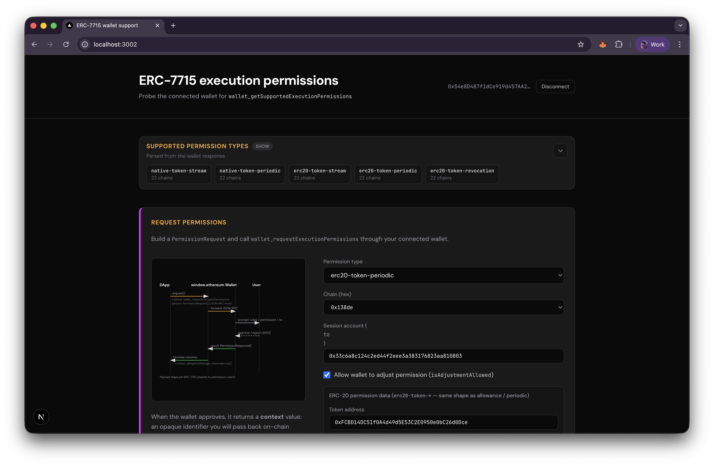

# ERC-7715 Execution Permissions

A Next.js web app for exploring [ERC-7715](https://eips.ethereum.org/EIPS/eip-7715) wallet execution permissions on Berachain. Connect a MetaMask wallet, probe supported permission types, request scoped execution permissions (native token or ERC-20), and redeem delegations on-chain via the returned `delegationManager`.



**How it works:**

1. **Probe** — calls `wallet_getSupportedExecutionPermissions` to discover which permission types, chains, and rule types the connected wallet supports.
2. **Request** — builds a `PermissionRequest` and calls `wallet_requestExecutionPermissions`, returning a `PermissionResponse` with a `context` and `delegationManager` address.
3. **Redeem** — submits a `redeemDelegations` transaction to the `delegationManager` contract (per ERC-7710), encoding either a native transfer or an ERC-20 `transfer`.

## Requirements

- [Node.js](https://nodejs.org/) v18+ (or [Bun](https://bun.sh/))
- A browser with [MetaMask](https://metamask.io/) installed (must support ERC-7715 — e.g. MetaMask Flask)

## Quickstart

Install dependencies:

```bash
bun install
```

Copy the example env file and fill in your values:

```bash
cp .env.example .env
```

```
# Where you want to send the funds to (session account)
SESSION_ACCOUNT_ADDRESS=0x...

# ERC-20 token address used as the default in the request form
TOKEN_ADDRESS=0x...
```

Both variables are optional — they pre-populate form fields in the UI.

Start the dev server:

```bash
bun run dev
```

The app runs at [http://localhost:3002](http://localhost:3002).
