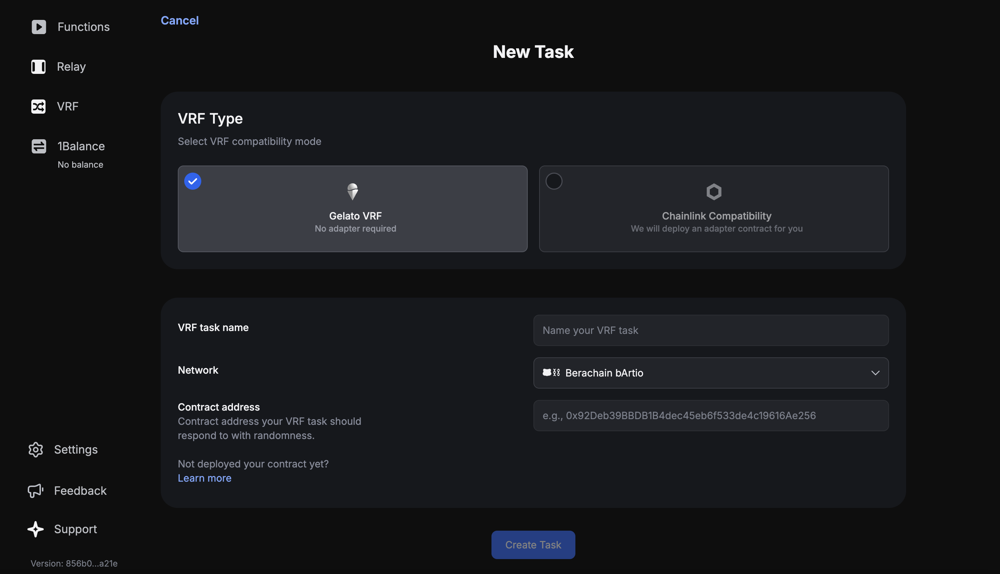

# Gelato VRF Jump Start

This repository provides example contracts and instructions for setting up Verifiable Random Function (VRF) on Gelato, utilizing Gelato VRF.

[](https://youtu.be/cUPjQYoH2OE)

## Overview

Verifiable Random Function (VRF) is a cryptographic primitive that generates unpredictable random numbers. Integrating VRF into Gelato allows for various decentralized applications (DApps) to leverage secure, on-chain randomness.

This repository includes contracts and configurations necessary for implementing VRF functionality on Gelato, making it easy for developers to integrate random number generation into their projects.

## Requirements

Before beginning, make sure you have the following installed or set up on your computer beforehand.  
- nvm or Node `v20.0.0` or greater
- pnpm, yarn, or npm 
- Wallet that contains BERA token (for deployment - see the [faucet](https://artio.faucet.berachain.com/))
- hardhat

## Gelato VRF: `SimpleVRFContract`

Create a `.env` file at the project root And populate it with your wallet's private key.

```bash
cp .env.example .env
```

To deploy the `SimpleVRFContract`, you'll need to install the dependencies first

```bash
npm install
```

Then run the following hardhat command:

```bash
npx hardhat deploy --network berachain
```

> [!NOTE]  
> Check the deployed addresses for each network in the `deployments/` folder, which is automatically created at the root of the `gelato-vrf/` directory following a deployment.


- **Description**: Contract for using Gelato VRF directly.
- **Contract Address on Berachain**: [0x2f32A4796bc8A37229FCfe8018f1fd6FBA19471C](https://bartio.beratrail.io/address/0x2f32A4796bc8A37229FCfe8018f1fd6FBA19471C)
- **Features**:
  - Requests randomness from Gelato VRF.
  - Handles the fulfillment of randomness.

## Create a Gelato VRF Task

Deploying your Gelato VRF instance is a straightforward process. Here's a step-by-step guide to get you started:

### Step 1. Gather Necessary Addresses
Before you begin, make sure you have the address of your requester contract at hand. This will be essential for the deployment process.

### Step 2. Access the VRF Deployment Portal
Navigate to the Gelato [app](https://app.gelato.network/vrf).

### Step 3. Select Deployment Network
Ensure you choose the `Berachain bArtio` network where your VRF requester and receiver contracts are deployed.

### Step 4. Specify the Request Contract
You'll be asked to provide the address of the Request Contract to which the Gelato nodes should respond. Enter the address you gathered in step 1 (in our example: **0x2f32A4796bc8A37229FCfe8018f1fd6FBA19471C**).

### Step 5. Launch your VRF Instance
Once all details are correctly entered, go ahead and launch your Gelato VRF instance.



## Monitor Execution

[Here](https://app.gelato.network/functions/task/0x245da8aefefecdcc5ee72daee5805440102381c44304ca67ea8e54326b7e520d:80084?origin=vrf) is an example task from the app that shows the fullfilled randomness

