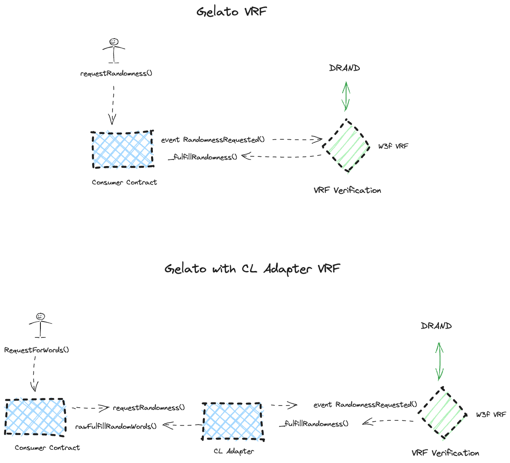
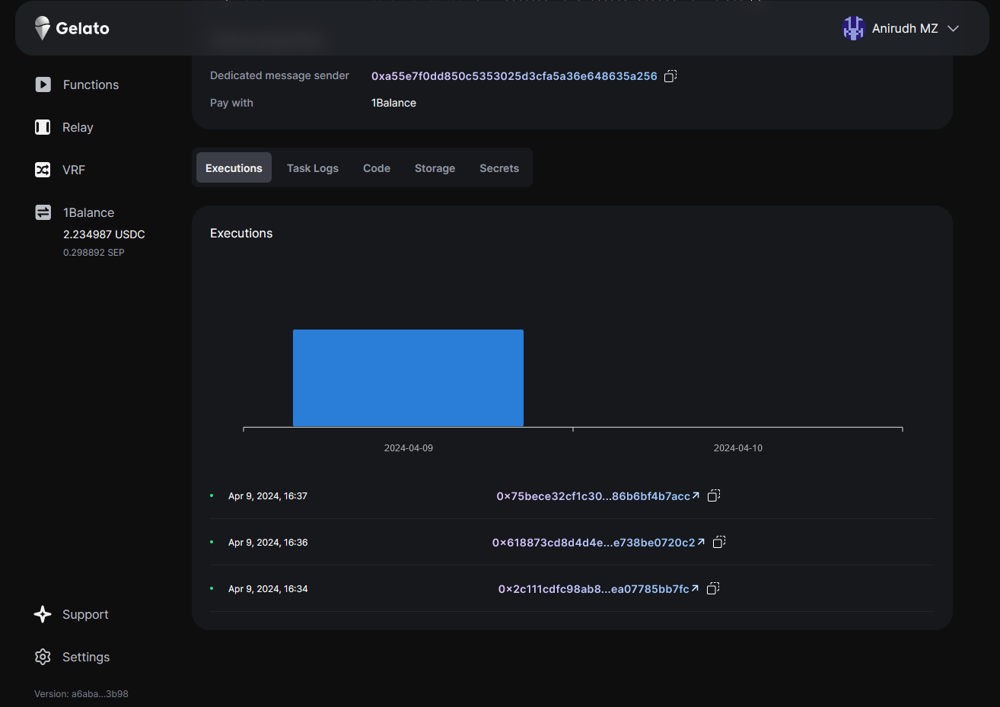

# How To #10 on Gelato: VRF Jump Start

This repository provides example contracts and instructions for setting up Verifiable Random Function (VRF) on Gelato, utilizing Gelato VRF.

## Overview

Verifiable Random Function (VRF) is a cryptographic primitive that generates unpredictable random numbers. Integrating VRF into Gelato allows for various decentralized applications (DApps) to leverage secure, on-chain randomness.

This repository includes contracts and configurations necessary for implementing VRF functionality on Gelato, making it easy for developers to integrate random number generation into their projects.

## Contracts

There are two types of VRF contracts available in this repository:

1. Gelato VRF

> [!NOTE]  
> Check the deployed addresses for each network in the deployments folder.

## Gelato VRF: `SimpleVRFContract`

- **Description**: Contract for using Gelato VRF directly.
- **Features**:
  - Requests randomness from Gelato VRF.
  - Handles the fulfillment of randomness.

# Create a Gelato VRF Task

To create a Gelato VRF Task, please refer to the documentation [here](https://docs.gelato.network/web3-services/vrf/quick-start/deploying-your-vrf-instance).

## Monitor Execution

[Here](https://app.gelato.network/functions/task/0x18a91b0e2538c3848c415666a402efa3510d26367d5134d33e0d23bcff011197:88153591557?origin=vrf) is an example task from the app that shows the fullfilled randomness

