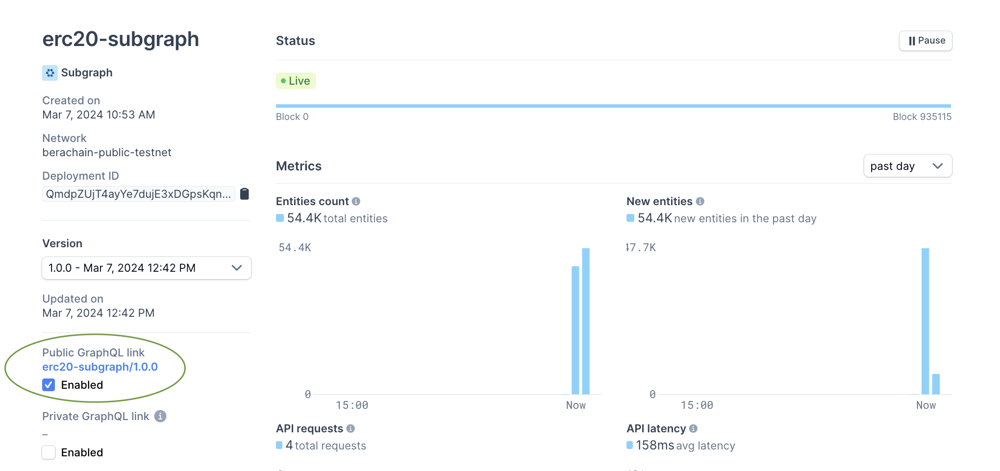
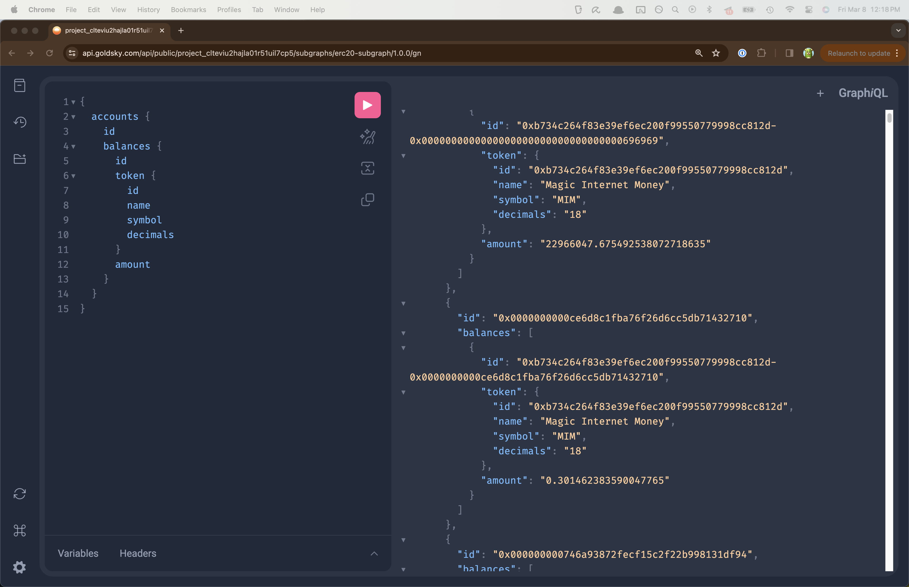

# Index & Query Berachain Data with Goldsky

An example using the [Goldsky](https://goldsky.com/) SDK to index Berachain blockchain data. Specifically, this repo provides subgraph code for indexing user ERC20 token balances.

👉 Try the [demo](https://api.goldsky.com/api/public/project_clteviu2hajla01r51uil7cp5/subgraphs/erc20-subgraph/1.0.0/gn)
👉 Read the Goldsky [developer docs](https://docs.goldsky.com/introduction)

## Requirements

- Nodejs `v20.11.0` or greater
- npm

## Quick Setup

### Step 1 - Install dependencies

```bash
# FROM: ./goldsky-subgraph

npm install;
```

### Step 2 - Set up Goldsky

1. Create an account at [app.goldsky.com](https://app.goldsky.com)
2. Create an API key on the Settings page
3. Install the Goldsky CLI:

```bash
curl https://goldsky.com | sh
```

4. Log in with the API key created earlier:

```bash
goldsky login
```

### Step 3 - Build Subgraph

```bash
# FROM: ./goldsky-subgraph;

npm run codegen;
npm run build;
```

### Step 4 - Deploy Subgraph

```bash
# FROM: ./goldsky-subgraph

goldsky subgraph deploy erc20-subgraph/1.0.0 --path .
```

### Step 5 - Query the Subgraph

After your subgraph has finished indexing, navigate to your public GraphQL link and try the following query:

```
{
  accounts {
    id
    balances {
      id
      token {
        id
        name
        symbol
        decimals
      }
      amount
    }
  }
}
```



### Result

You can now query the subgraph in the GraphQL playground to retrieve user ERC20 token balances.


