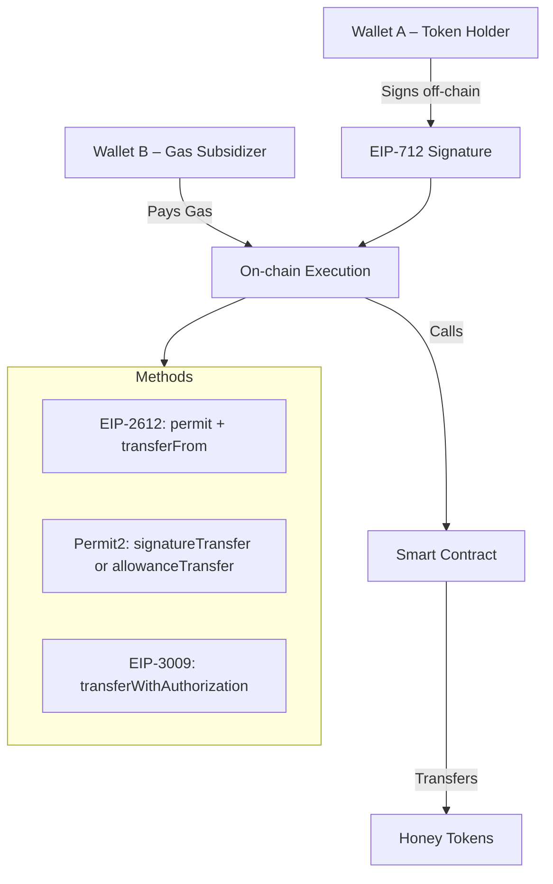

# Honey Token: EIP-2612, Permit2, and EIP-3009 Demo

This project demonstrates the differences between three gasless transaction standards:
- **EIP-2612 (Permit)**: Gasless token approvals via signed messages
- **Permit2**: Uniswap's universal approval system for any ERC20 token
- **EIP-3009 (Transfer With Authorization)**: Gasless token transfers via authorization signatures

## Project Overview

### Standards Comparison

| Feature | EIP-2612 | Permit2 | EIP-3009 |
|---------|----------|---------|----------|
| **Purpose** | Gasless approvals | Universal approvals/transfers | Gasless transfers |
| **Nonce Type** | Sequential | Non-monotonic | Random (32-byte) |
| **Works With** | EIP-2612 tokens only | Any ERC20 token | EIP-3009 tokens only |
| **Pattern** | Approve + TransferFrom | Direct transfer or allowance | Direct transfer |
| **Parallel Txs** | No (sequential nonces) | Yes | Yes (random nonces) |

### Architecture

The demo uses a two-wallet pattern with private keys loaded from `.env`:
- **Wallet A — Token Holder** (`PRIVATE_KEY`): Has HONEY tokens, signs messages off-chain (no gas)
- **Wallet B — Gas Subsidizer** (`PRIVATE_KEY_GAS_SUBSIDIZER`): Has BERA for gas, executes transactions on-chain (pays gas)

No browser wallet (MetaMask) is needed — signing and execution happen automatically using the private keys.



## Prerequisites

### 1. Install Foundry

```bash
curl -L https://foundry.paradigm.xyz | bash
foundryup
```

Verify installation:
```bash
forge --version
```

### 2. Install Bun

```bash
curl -fsSL https://bun.sh/install | bash
```

Verify installation:
```bash
bun --version
```

## Quick Start

### Option A: Automated Setup (Recommended)

```bash
chmod +x setup.sh
./setup.sh
```

This will:
- Check for Foundry and Bun installations
- Install Solidity dependencies (forge-std, OpenZeppelin)
- Build contracts
- Create `.env` from `.env.example`
- Install frontend dependencies
- Copy `deployments.json` to the frontend (if contracts were previously deployed)

After setup completes, follow the **Next steps** printed in the terminal (start Anvil, deploy contracts, start frontend).

### Option B: Manual Setup

#### 1. Setup Environment

```bash
# Copy the example .env (contains Anvil default keys)
cp .env.example .env
```

The `.env` file contains three keys:

```bash
# Token Holder — signs permits/authorizations (no gas cost)
PRIVATE_KEY=0xac0974bec39a17e36ba4a6b4d238ff944bacb478cbed5efcae784d7bf4f2ff80

# Gas Subsidizer — submits transactions on-chain (pays gas)
PRIVATE_KEY_GAS_SUBSIDIZER=0x59c6995e998f97a5a0044966f0945389dc9e86dae88c7a8412f4603b6b78690d

# Deployer — deploys contracts
DEPLOYER_PRIVATE_KEY=0xac0974bec39a17e36ba4a6b4d238ff944bacb478cbed5efcae784d7bf4f2ff80
```

> **Note:** These are Anvil default keys (accounts #1, #2, #0 respectively). The frontend has built-in fallbacks to these keys, so `.env` is optional for local development.

#### 2. Setup Contracts

```bash
cd contracts

# Install Solidity dependencies (requires git)
forge install foundry-rs/forge-std OpenZeppelin/openzeppelin-contracts

# Build contracts
forge build
```

#### 3. Start Anvil (Local EVM Network)

In a separate terminal:

```bash
anvil
```

Anvil starts on `http://localhost:8545` with Chain ID `31337` and pre-funded accounts.

#### 4. Deploy Contracts

```bash
cd contracts
forge script script/Deploy.s.sol:DeployScript \
  --rpc-url http://localhost:8545 \
  --broadcast
```

The deploy script reads `DEPLOYER_PRIVATE_KEY` from the project root `.env`. If not found, it falls back to Anvil's default key.

This will:
- Deploy Permit2
- Deploy the Honey ERC20 token (with EIP-2612 and EIP-3009 support)
- Deploy the Demo contract (wired to Honey and Permit2)
- Transfer 1,000 HONEY tokens to the token holder wallet
- Approve Permit2 to spend the token holder's HONEY (required for Permit2 demos)
- Write `deployments.json` with all contract addresses (Honey, Demo, Permit2)

#### 5. Start Frontend

```bash
cd frontend

# Install dependencies
bun install

# Start development server (auto-copies deployments.json from contracts/)
bun run dev
```

> **Note:** `bun run dev` automatically copies `contracts/deployments.json` to `frontend/public/` before starting the dev server. No manual copy needed.

The frontend will be available at `http://localhost:5173`.

## Project Structure

```
honey-x402-demo/
├── .env.example           # Environment variable template
├── contracts/             # Foundry project
│   ├── src/
│   │   ├── Honey.sol      # ERC20 with EIP-2612 & EIP-3009
│   │   ├── Demo.sol       # Demo contract for all three methods
│   │   └── Permit2/       # Permit2 interfaces
│   ├── script/
│   │   └── Deploy.s.sol   # Deployment script (deploys Permit2, Honey, Demo)
│   ├── deployments.json   # Generated contract addresses (after deploy)
│   ├── foundry.toml       # Foundry configuration
│   └── remappings.txt     # Import remappings
├── frontend/              # React + Vite + viem + wagmi
│   ├── src/
│   │   ├── components/
│   │   │   ├── WalletDisplay.tsx   # Wallet balance display
│   │   │   ├── EIP2612Demo.tsx     # EIP-2612 demo
│   │   │   ├── Permit2Demo.tsx     # Permit2 demo
│   │   │   └── EIP3009Demo.tsx     # EIP-3009 demo
│   │   ├── config/
│   │   │   ├── wagmi.ts    # Wagmi chain config (reads only)
│   │   │   └── clients.ts  # viem wallet clients from .env keys
│   │   ├── App.tsx
│   │   └── main.tsx
│   └── package.json
├── setup.sh               # Automated setup script
└── README.md
```

## Usage Guide

### How the Demo Works

1. Open `http://localhost:5173` — you'll see two wallet cards:
   - **Wallet A — Token Holder**: Shows HONEY and BERA balances (loaded from `PRIVATE_KEY`)
   - **Wallet B — Gas Subsidizer**: Shows HONEY and BERA balances (loaded from `PRIVATE_KEY_GAS_SUBSIDIZER`)

2. Each demo section has a **two-step flow** with separate buttons:
   - **Step 1 — "Wallet A: Sign … (Off-chain, No Gas)"**: Signs an EIP-712 message using Wallet A's private key. This is free — no gas is spent.
   - **Step 2 — "Wallet B: Execute On-chain (Pays Gas)"**: Submits the signed message on-chain using Wallet B's private key. Wallet B pays for gas.

3. Watch the step indicator progress from **"Wallet A Signs"** → **"Wallet B Executes"**

4. After execution, view the **Transaction Receipt** (gas used, cost) and **Transfer Summary** (who sent, who paid)

### EIP-2612 Demo

- Enter amount of HONEY to transfer
- Click **"1. Wallet A: Sign Permit (Off-chain, No Gas)"** — signs a `permit()` approval
- Click **"2. Wallet B: Execute On-chain (Pays Gas)"** — calls `permit() + transferFrom()` in one transaction
- Uses **sequential nonces** (shown in the UI)

### Permit2 Demo

- Choose method:
  - **Signature Transfer** — one-time use, random nonce, exact amount
  - **Allowance Transfer** — reusable until cap/expiry, with configurable time-bound limits (allowance expiration and signature deadline)
- Enter amount and click **"1. Wallet A: Sign Permit2 (Off-chain, No Gas)"**
- Click **"2. Wallet B: Execute On-chain (Pays Gas)"**
- Works with any ERC20 token — Permit2 is a universal approval layer

### EIP-3009 Demo

- Enter amount and click **"1. Wallet A: Sign Authorization (Off-chain, No Gas)"**
- Click **"2. Wallet B: Execute On-chain (Pays Gas)"**
- Uses a **random 32-byte nonce** (enables parallel authorizations)
- Does the transfer directly — no separate approval step

## Development Commands

### Contracts

```bash
cd contracts

# Compile
forge build

# Run tests
forge test

# Deploy to Anvil
forge script script/Deploy.s.sol:DeployScript \
  --rpc-url http://localhost:8545 \
  --broadcast

# Format Solidity code
forge fmt

# Check contract sizes
forge build --sizes
```

### Frontend

```bash
cd frontend

# Install dependencies
bun install

# Start development server
bun run dev

# Build for production
bun run build

# Preview production build
bun run preview

# Run linter
bun run lint
```

## Troubleshooting

### Contracts Won't Compile

- Ensure Solidity dependencies are installed: `forge install foundry-rs/forge-std OpenZeppelin/openzeppelin-contracts`
- Check `remappings.txt` for correct paths
- Verify Solidity version `0.8.24` in `foundry.toml`

### Frontend Can't Connect to Anvil

- Ensure Anvil is running on `http://localhost:8545`
- Check that `vite.config.ts` points `envDir` to the project root (`../`)
- Verify network ID is 31337

### Frontend Shows "Contracts not deployed"

- Deploy contracts first — `deployments.json` is generated by the deploy script
- `bun run dev` auto-copies it, but for a manual copy:
  ```bash
  cp contracts/deployments.json frontend/public/
  ```

### Signature / Transaction Errors

- Ensure `.env` exists in the project root with correct keys (or rely on the built-in Anvil fallback keys)
- Verify contract addresses in `deployments.json` match deployed contracts
- For EIP-3009, nonces are random — each click generates a new unique nonce
- Check the domain separator (chain ID 31337, correct contract address, name, version)

### Permit2 Errors

- Permit2 is deployed automatically by the deploy script alongside Honey and Demo
- The deploy script also has the token holder approve Permit2 for max HONEY
- If you see allowance errors, redeploy contracts to reset the Permit2 approval

## Additional Resources

- [EIP-2612: Permit Extension for EIP-20](https://eips.ethereum.org/EIPS/eip-2612)
- [EIP-3009: Transfer With Authorization](https://eips.ethereum.org/EIPS/eip-3009)
- [Permit2 Documentation](https://github.com/Uniswap/permit2)
- [viem Documentation](https://viem.sh)
- [Wagmi Documentation](https://wagmi.sh)

## License

MIT
