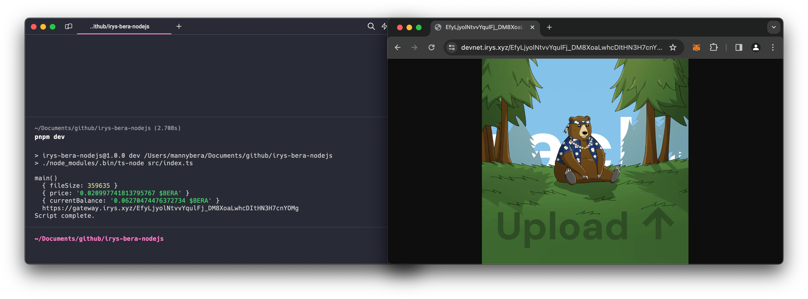

# Irys NodeJS Upload Script With Berachain $BERA Tokens

An example using the [Irys JS SDK](https://docs.irys.xyz) to permanently upload files to Arweave using Berachain `$BERA` tokens to pay for the transactions.



## Requirements

-   NMV or Node `v20.11.0` or greater
-   Wallet with testnet $BERA tokens - See the [Berachain Artio Faucet](https://artio.faucet.berachain.com)

## Quick Setup

### Step 1 - Install Dependencies

```bash
# FROM: ./irys-bera-nodejs

pnpm install;
```

### Step 2 - Set Environment Variables

```bash
# FROM: ./irys-bera-nodejs

cp .env.example .env;
```

Remember to change your private key.

**File:** `./.env`

```bash
# Wallet Configuration
WALLET_PRIVATE_KEY="<YOUR_WALLET_PRIVATE_KEY>"
```

### Step 3 - Run Script

```bash
# FROM: ./irys-bera-nodejs

pnpm dev;

# [Expected Output]:
# main()
#   { fileSize: 359635 }
#   { price: '0.020997741813795767 $BERA' }
#   { currentBalance: '0.06270474476372734 $BERA' }
#   https://gateway.irys.xyz/EfyLjyolNtvvYqulFj_DM8XoaLwhcDItHN3H7cnYOMg
# Script complete.
```
