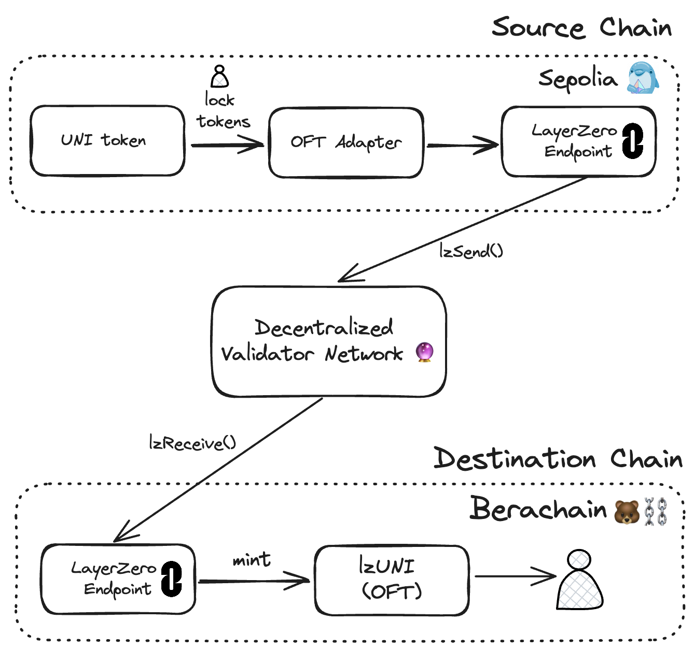

# Bridging ERC20 Tokens from Base to Berachain with LayerZero V2

This repository contains an example of how to deploy a custom ERC20 token on Base, create a LayerZero adapter, deploy an OFT on Berachain, and migrate tokens from Base to Berachain using LayerZero V2 and their Omnichain Fungible Token (OFT) standard.

👉 Learn more about [LayerZero V2](https://docs.layerzero.network/v2)



## Requirements

- Node `v20.11.0` or greater
- npm
- Wallet with Berachain Mainnet $BERA tokens - See [Berachain Bridge](https://bridge.berachain.com)
- Wallet with Base Mainnet $ETH tokens - See [Base Bridge](https://bridge.base.org/deposit)
- [Foundry](https://book.getfoundry.sh/getting-started/installation) - ensure `foundryup` is run to install binaries

### Step 1 - Setup Project & Install Dependencies

Install project dependencies:

```bash
# FROM: ./layerzero-oft

npm install;
```

### Step 2 - Deploy Custom Token to Base

Create a `.env` file at the root of `./layerzero-oft` with the following and populate it with your `PRIVATE_KEY`:

```toml
PRIVATE_KEY=
BASE_TOKEN_ADDRESS=
BASE_ADAPTER_ADDRESS=
BERACHAIN_OFT_ADDRESS=
```

Deploy your custom ERC20 token to Base Mainnet:

```bash
# FROM: ./layerzero-oft

forge script script/MyToken.s.sol --rpc-url https://mainnet.base.org --broadcast
```

Update `BASE_TOKEN_ADDRESS` in your `.env` file with the address of your token deployment.

**Example Deployment:**
- **Token Address**: `0xB855AD471a3a865A81F6057ee3868531784447fA`
- **BaseScan**: [View Contract](https://basescan.org/address/0xb855ad471a3a865a81f6057ee3868531784447fa)

### Step 3 - Deploy Adapter to Base

Deploy `MyAdapter.sol` to Base Mainnet:

```bash
# FROM: ./layerzero-oft

forge script script/MyAdapter.s.sol --rpc-url https://mainnet.base.org --broadcast
```

Update `BASE_ADAPTER_ADDRESS` in your `.env` file with the address of your `MyAdapter` deployment.

**Example Deployment:**
- **Adapter Address**: `0x031A382C7C1AfE8587A663355804878efB56ce52`
- **BaseScan**: [View Contract](https://basescan.org/address/0x031A382C7C1AfE8587A663355804878efB56ce52)

### Step 4 - Deploy OFT to Berachain

Deploy `MyOFT.sol` to Berachain:

```bash
# FROM: ./layerzero-oft

forge script script/MyOFT.s.sol --rpc-url https://rpc.berachain.com/ --broadcast
```

Update `BERACHAIN_OFT_ADDRESS` in your `.env` file with the address of your `MyOFT` deployment.

**Example Deployment:**
- **OFT Address**: `0x6CB0268387BAEFaace08b2368F21E8983Ec05988`
- **Berachain Explorer**: [View Contract](https://berascan.com/address/0x6cb0268387baefaace08b2368f21e8983ec05988)
- **Verification GUID**: `aglxnljk3fxvqejt18xsgxzqvp4cvdehrpdrmkjk8bgbh7kcpb`

### Step 5 - Bridge Tokens from Base to Berachain

Finally, run the `Bridge.s.sol` script to bridge your custom tokens from Base to Berachain:

```bash
# FROM: ./layerzero-oft

forge script script/Bridge.s.sol --rpc-url https://mainnet.base.org --broadcast
```

**Example Bridge Transaction:**
- **Transaction Hash**: `0x97839ee1064b61d7ac6acf339a9e7e985ed8dee7c809bc5c62a56a40b50bb063`
- **Block Number**: `36269727`
- **Amount Bridged**: `100 MCT` (100 tokens)
- **BaseScan**: [View Transaction](https://basescan.org/tx/0x97839ee1064b61d7ac6acf339a9e7e985ed8dee7c809bc5c62a56a40b50bb063)

## Step 6 - Configure DVN Settings (IMPORTANT: Prevents DVN Mismatch Errors)

**Critical**: You must configure DVNs for receive operations on both chains to prevent "DVN mismatch" errors. This is often missed but essential for proper cross-chain functionality.

### DVN Addresses (From LayerZero Team Feedback)

These are the verified DVN addresses for Base and Berachain:

**Base DVNs:**
- Base LayerZero DVN: `0x9e059a54699a285714207b43b055483e78faac25`
- Base Nethermind DVN: `0xcd37ca043f8479064e10635020c65ffc005d36f6`

**Berachain DVNs:**
- Berachain LayerZero DVN: `0x282b3386571f7f794450d5789911a9804fa346b4`
- Berachain Nethermind DVN: `0xdd7b5e1db4aafd5c8ec3b764efb8ed265aa5445b`
- Optional Berachain BERA DVN: `0x10473bd2f7320476b5e5e59649e3dc129d9d0029`

### Configure DVNs After Deployment

1. **Configure Base Adapter (for receiving from Berachain)**:

```bash
# FROM: ./layerzero-oft

forge script script/ConfigureBaseDVNs.s.sol --rpc-url https://mainnet.base.org --broadcast
```

2. **Configure Berachain OFT (for receiving from Base)**:

```bash
# FROM: ./layerzero-oft

forge script script/ConfigureBerachainDVNs.s.sol --rpc-url https://rpc.berachain.com/ --broadcast
```

### Alternative: Complete Configuration Script

If you prefer to configure both chains at once:

```bash
# FROM: ./layerzero-oft

# This script configures both Base and Berachain DVNs
forge script script/ConfigureDVNs.s.sol --rpc-url https://mainnet.base.org --broadcast
```

### Troubleshooting DVN Mismatch

If you encounter a "DVN mismatch" error when bridging, it means:

1. **Receive DVNs are not configured** - The receiving contract doesn't know which DVNs to trust
2. **Incorrect DVN addresses** - The DVNs you configured don't match the actual DVN addresses for the chains
3. **Missing DVNs in receive config** - You may have configured send DVNs but not receive DVNs

### DVN Configuration Explained

The scripts configure **receive ULN configs** which tell your contracts:
- Which DVNs are required to verify incoming messages
- Which DVNs are optional 
- How many confirmations are needed

This is different from send configurations and must be done for **both directions** of the bridge:

- **Base → Berachain**: Configure BERACHAIN OFT receive DVNs
- **Berachain → Base**: Configure BASE ADAPTER receive DVNs

**Note**: Always verify current DVN addresses at the [LayerZero DVN Providers](https://docs.layerzero.network/v2/deployments/dvn-addresses) as they may change.
