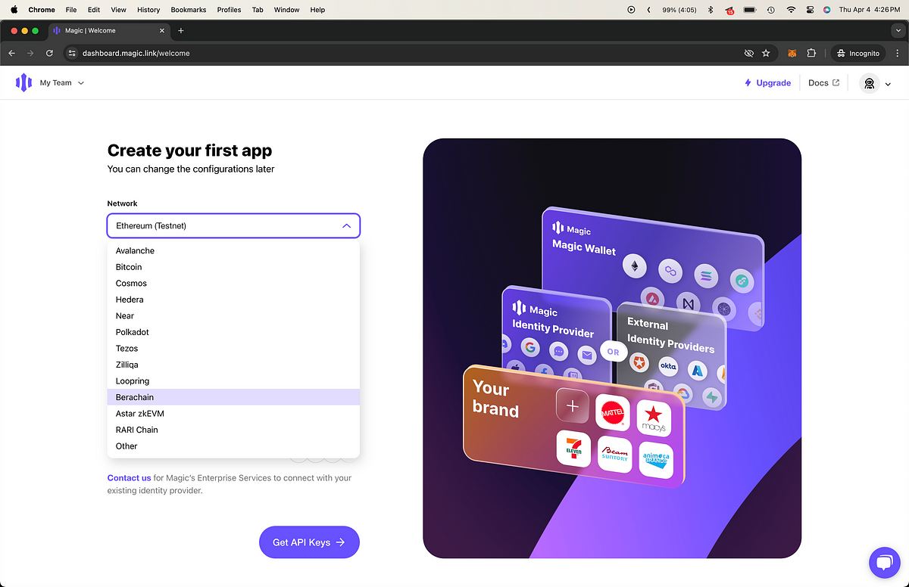

# Berachain with Magic Wallet and RainbowKit

[Magic](https://magic.link/) offers passwordless Ethereum wallets and provides authentication options such as email and social login (Google, Facebook, etc). [RainbowKit](https://www.rainbowkit.com/) is a React library offering an intuitive wallet-connection interface.

This repository provides a guide on integrating Magic with RainbowKit on Berachain Testnet.

👉 Try the [demo](https://stunning-bubblegum-33f884.netlify.app/)

## Requirements

- Node v20.11.0
- pnpm (or another prefered package manager)
- Wallet with testnet $BERA tokens - See the [Berachain Artio Faucet](https://artio.faucet.berachain.com)

## Getting Started

### 1 - Install Dependencies

```bash
# FROM: ./magic-rainbow

pnpm install;
```

### 2 - Get Magic API Key

Go to [https://dashboard.magic.link/signup](https://dashboard.magic.link/signup]), sign up for an account, create an app on Berachain to get an API key.



### 3 - Replace API Key

In `./src/index.tsx`, replace `YOUR_MAGIC_API_KEY` with the API key obtained from the Magic dashboard.

### 4 - Run App

```bash
# FROM: ./magic-rainbow

pnpm start;
```

### 5 - Send Transaction Using Magic Wallet

1. In the running app, click the "Connect Wallet" button and select "Magic". Follow the prompts to sign in to your Magic wallet.
2. Copy the connected Magic wallet address
3. Send testnet $BERA tokens to the connected Magic wallet address
4. Use the form to send testnet $BERA tokens to another address from the connected Magic wallet


