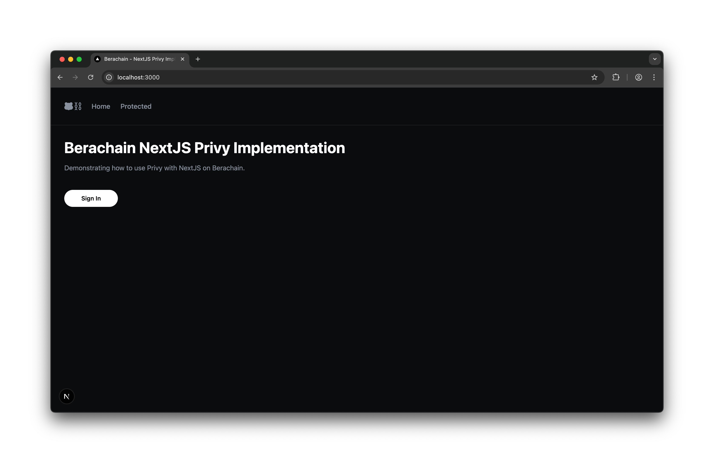

# Berachain - NextJS16 + Privy Demo

A demonstration NextJS 16 app utilizing Privy for authenications, embedded wallets, and route authentication.



## Requirements

- node `v22.14.0` or greater (or just `nvm install`)
- npm (comes with node)
- Privy acocunt with credentials - See [https://dashboard.privy.io](https://dashboard.privy.io)

## Quick Start

### 1. Configure Environment Variables

```bash
# FROM: ./

cp .env.example .env.local;
```

### 2. Install & Start Server

```bash
# FROM: ./

npm install;
npm run dev;

# [Expected Output]:
# > next dev
#
#    ▲ Next.js 16.0.0 (Turbopack)
#    - Local:        http://localhost:3000
#    - Network:      http://10.0.0.4:3000
#    - Environments: .env.local
#
#  ✓ Starting...
#  ✓ Ready in 709ms
```

## Author

[@codingwithmanny](https://github.com/codingwithmanny)
