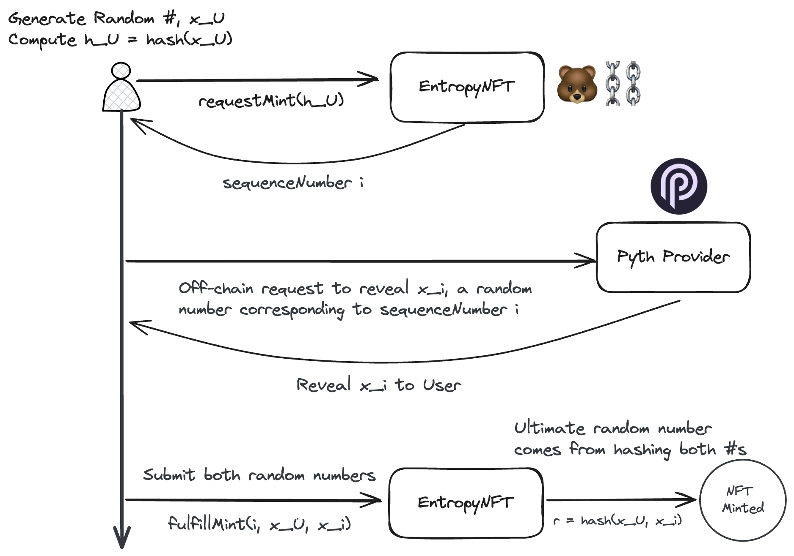

# Minting Provably Fair NFTs with Pyth Entropy on Berachain

This repository demonstrates how to leverage Pyth's Entropy service to enable provably fair NFT minting on the Berachain network. By utilizing Entropy, developers can generate secure random numbers on-chain, ensuring the fairness of an NFT minting process.

👉 Learn more about [Pyth Entropy](https://docs.pyth.network/entropy)

## Requirements

- Node `v20.11.0` or greater
- pnpm (or another preferred package manager)
- Wallet with Berachain Testnet $BERA tokens - See the [Berachain Artio Faucet](https://artio.faucet.berachain.com)
- [Foundry](https://book.getfoundry.sh/getting-started/installation) - ensure `foundryup` is run to install binaries

### Overview of Randomized Minting Process



### Step 1 - Setup Project & Install Dependencies

Install project dependencies:

```bash
# FROM: ./pyth-entropy

pnpm install;
```

Run the following to add remappings to `foundry.toml`:

```bash
# FROM: ./pyth-entropy

echo "remappings = ['@pythnetwork/entropy-sdk-solidity/=node_modules/@pythnetwork/entropy-sdk-solidity', '@openzeppelin/contracts/=node_modules/@openzeppelin/contracts']" >> ./foundry.toml
```

### Step 2 - Deploy the NFT Minting Contract

Create a `.env` file at the project root and populate it with the following:

```toml
RPC_URL=https://artio.rpc.berachain.com/
ENTROPY_NFT_ADDRESS=YOUR_ENTROPY_NFT_ADDRESS
PRIVATE_KEY=YOUR_PRIVATE_KEY
ENTROPY_ADDRESS=0x26DD80569a8B23768A1d80869Ed7339e07595E85
PROVIDER_ADDRESS=0x6CC14824Ea2918f5De5C2f75A9Da968ad4BD6344
```

Replace `YOUR_PRIVATE_KEY` with your wallet's private key.

Load these environment variables into your terminal session:

```bash
# FROM: ./pyth-entropy

source .env;
```

Now deploy the EntropyNFT contract to the Berachain Testnet:

```bash
# FROM: ./pyth-entropy

forge create src/EntropyNFT.sol:EntropyNFT \
--private-key $PRIVATE_KEY \
--rpc-url $RPC_URL \
--constructor-args $ENTROPY_ADDRESS $PROVIDER_ADDRESS \
```

Update the `ENTROPY_NFT_ADDRESS` in the `.env` file with your deployed contract address.

### Step 3 - Mint a Randomized NFT

Run the `app/requestMint.js` script to:

1. Request a random number from Pyth; and
2. Poll the NFT contract events for when Pyth executes the minting callback (expected to happen in a few blocks)

```bash
# FROM: ./pyth-entropy

node app/requestMint.js;

# [Example Output]:
# ✅ NFT ID 303 minted to 0xf290f3d843826d00f8176182fd76550535f6dbb4, based on sequenceNumber 114
```

You will now have minted a randomized NFT from your new collection!
