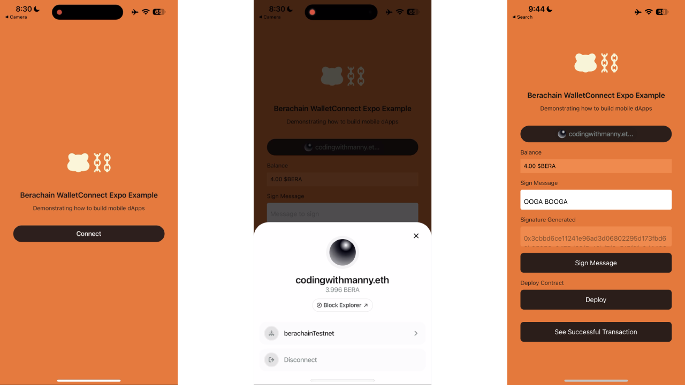
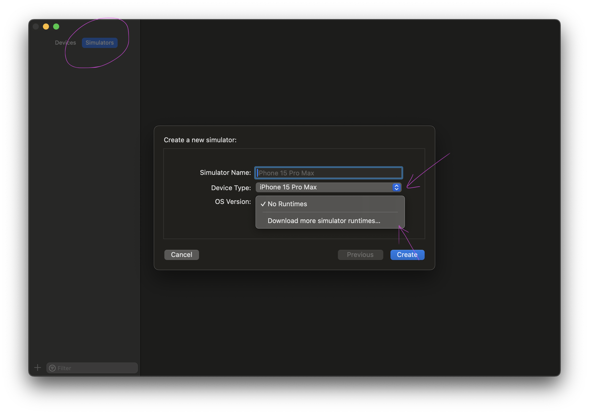
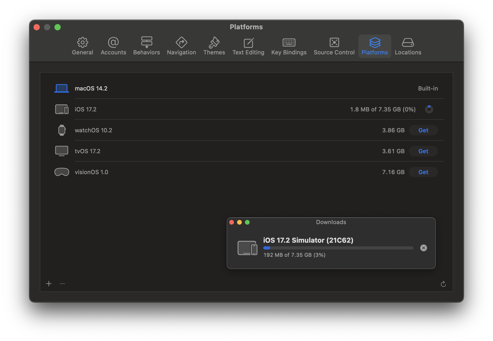

# Berachain WalletConnect Expo

An example of Berachain being used with WalletConnect and Expo.



## Requirements

- Node v20.11.0
- pnpm or npm
- Expo Go - [Download Expo Go](https://expo.dev/expo-go)
- iOS Simulator - See [iOS Simulator Configuration](#ios-simulator-configuration)
- Android - (coming soon)

## Getting Started

This will walk through the steps to get up and running.

### 1 - Install Dependencies

```bash
# FROM: ./expo-walletconnect

# !!!IMPORTANT: make sure to have the flag for --ignore-workspace otherwise this will NOT WORK
pnpm install --ignore-workspace;
# or npm install;
```

### 2 - Get WalletConnect Project ID

Go to [https://cloud.walletconnect.com](https://cloud.walletconnect.com), sign up for an account, and get a project id.

### 3 - Set Environment Variables

```bash
# FROM: ./walletconnect-expo

cp .env.example .env;
```

**File:** `./env`

```bash
# Expo Metadata
EXPO_PUBLIC_METADATA_NAME="Berachain WalletConnect Expo"
EXPO_PUBLIC_METADATA_DESCRIPTION="Berachain WalletConnect Expo Example"
EXPO_PUBLIC_METADATA_URL="https://berachain.com"
EXPO_PUBLIC_METADATA_ICONS="https://avatars.githubusercontent.com/u/96059542"
EXPO_PUBLIC_METADATA_REDIRECT_NAME="YOUR_APP_SCHEME://"
EXPO_PUBLIC_METADATA_REDIRECT_UNIVERSAL="YOUR_APP_UNIVERSAL_LINK.com"

# WalletConnect - See https://cloud.walletconnect.com
EXPO_PUBLIC_WALLET_CONNECT_PROJECT_ID="YOUR_PROJECT_ID"

# Chain
EXPO_PUBLIC_CHAIN_ID=80085
EXPO_PUBLIC_CHAIN_NAME="berachainTestnet"
EXPO_PUBLIC_CHAIN_NETWORK="Berachain"
EXPO_PUBLIC_CHAIN_NATIVECURRENCY_DECIMALS=18
EXPO_PUBLIC_CHAIN_NATIVECURRENCY_NAME="Bera Token"
EXPO_PUBLIC_CHAIN_NATIVECURRENCY_SYMBOL="BERA"
EXPO_PUBLIC_CHAIN_RPC_URL="https://rpc.ankr.com/berachain_testnet"
EXPO_PUBLIC_CHAIN_BLOCKEXPLORER_NAME="Beratrail"
EXPO_PUBLIC_CHAIN_BLOCKEXPLORER_URL="https://artio.beratrail.io"
```

### 4 - Run iOS App In Expo Go

```bash
# FROM: ./walletconnect-expo

pnpm ios;

# [Expected Output]:
# › Opening the iOS simulator, this might take a moment.
# ▄▄▄▄▄▄▄▄▄▄▄▄▄▄▄▄▄▄▄▄▄▄▄▄▄▄▄
# █ ▄▄▄▄▄ █   █▄▀▀▄██ ▄▄▄▄▄ █
# █ █   █ █ ▀▄ █▀█ ▄█ █   █ █
# █ █▄▄▄█ █▀██▀▀ ▀▄██ █▄▄▄█ █
# █▄▄▄▄▄▄▄██▄▄▄▄▄▄▄█▄▀▄█▄▄▄▄█
# █ ▄▀█ ▄▄██▀▀▄▀▄  ▄▀█ ▀▄▄ ▄█
# █▄█▀ ██▄▄ █▀ ▄ ▄▄  █▀   ▀██
# █▀█ ▀█▄▄█ ▀▄█▄ ▀ ▄█▄ ▀▄ ▀██
# ████▀ ████▀ ████▀ ████▀ ███
# █▄▄▄▄▄▄█▄▄▄▄▄▄▄█▄▀▄█▄▄▄▄█▄▀
# █ ▄▄▄▄▄ █▀▀▄ ▄ ▄▀ █▄█ ▀▀█▀█
# █ █   █ █▄▀ █▄ ▀█ ▄ ▄▄▀ ▀ █
# █ █▄▄▄█ █▀▀▄█▀█▀▀█▀▄▀█▀▀ ██
# █▄▄▄▄▄▄▄█▄▄█▄█▄▄███▄▄▄▄▄▄▄█
#
# › Metro waiting on exp://10.0.0.6:8081
# › Scan the QR code above with Expo Go (Android) or the Camera app (iOS)
#
# › Web is waiting on http://localhost:8081
#
# › Using Expo Go
# › Press s │ switch to development build
#
# › Press a │ open Android
# › Press i │ open iOS simulator
# › Press w │ open web
#
# › Press j │ open debugger
# › Press r │ reload app
# › Press m │ toggle menu
# › Press o │ open project code in your editor
```

Scan the QR code with your mobile Phone camera to load the app in `Expo Go`.

## iOS Simulator Configuration

If you're on the latest MacOS Sonoma and have XCode installed, chances are you need to have to also download additional simulator run times.

In order to do so, run `XCode` and go to `Window` > `Devices & Simulators`.

Select `Simulator` in the top right, select `Device Type`, and for `OS Version` select `Download more simulator runtimes...`



This will then display a new window to download the latest iOS simulator.


