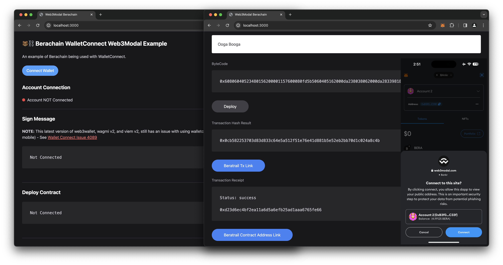

# Berachain WalletConnect NextJS

An example of Berachain being used with WalletConnect.



## Requirements

- Node v20.11.0
- pnpm or npm

## Getting Started

### 1 - Install Dependencies

```bash
# FROM: ./walletconnect-nextjs

pnpm install;
# or npm install;
```

### 2 - Get WalletConnect Project ID

Go to [https://cloud.walletconnect.com](https://cloud.walletconnect.com]), sign up for an account, and get a project id.

Create an `.env` files from `.env.example` and add `NEXT_PUBLIC_PROJECT_ID`.

```bash
# FROM: ./walletconnect-nextjs

copy .env.example .env;
```

Modify the following file section

**File:** `./env.example`

```bash
# Get projectId at https://cloud.walletconnect.com
NEXT_PUBLIC_PROJECT_ID=YOUR-WALLETCONNECT-PROJECT-ID
```

### 3 - Run Environment

```bash
# FROM: ./walletconnect-nextjs

pnpm dev;
# or npm run dev;

# [Expected Output]:
# > berachain-walletconnect-nextjs@1.0.0 dev /path/to/nextjs-walletconnect-berachain
# > next dev
#
#    ▲ Next.js 14.0.4
#    - Local:        http://localhost:3000
#    - Environments: .env
#
#  ✓ Ready in 1349ms
```

### 4 - Use Mobile MetaMask

Make sure you have the [MetaMask mobile app](https://metamask.io/download/).

> **NOTE:** Other Mobile wallets have not been tested. You will need make sure to have a wallet that supports adding a custom RPC network.

For RPC configuration details, see [Berachain Docs](https://docs.berachain.com/developers).

A - Click **_Connect Wallet_** and choose **_WalletConnect_**

B - Open up MetaMask Mobile and tap the **_QR code icon_** in the top right of the app

C - Scan the QR from WalletConnect with your MetaMask Mobile App

D - Enter a `_greeting` for the contract input in the NextJS main pae

F - Click **Deploy** and confirm the transaction in MetaMask Mobile

G - Wait for transaction to complete and see the deployed contract address
