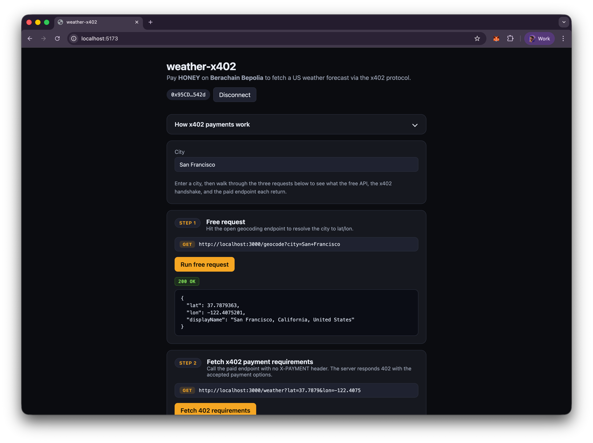
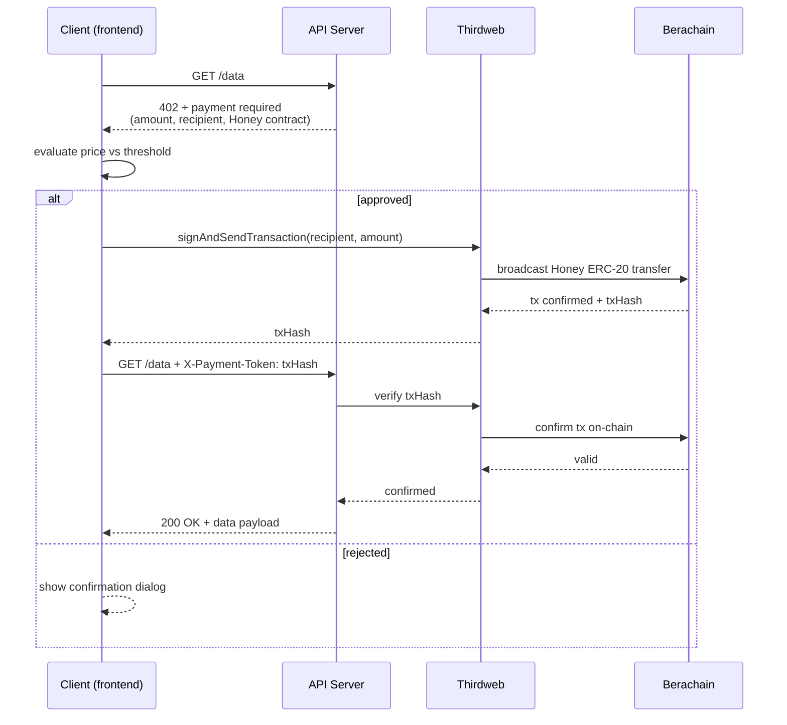

# x402 on Berachain — HONEY-gated Weather API

A full-stack example that gates a US weather forecast endpoint behind an [x402](https://x402.org) paywall priced in **HONEY** on **Berachain**, with settlement delegated to the [Thirdweb x402 facilitator](https://portal.thirdweb.com/x402/facilitator).



This repo has two pieces:

| Folder          | Description                                                                                                                                      |
| --------------- | ------------------------------------------------------------------------------------------------------------------------------------------------ |
| [`api/`](./api) | [Hono](https://hono.dev/) service exposing `/geocode` (free) and `/weather` (paid, 0.1 HONEY). Emits x402 v2 `402 Payment Required` responses.   |
| [`web/`](./web) | Vite + React + wagmi + viem frontend that connects MetaMask, signs the x402 authorization, and renders the forecast plus the settlement receipt. |

The payer signs an EIP-3009 `TransferWithAuthorization` (or ERC-2612 `permit`) over HONEY. The Thirdweb facilitator verifies the signature and submits the transfer on Berachain gaslessly via EIP-7702 using your server wallet, so the payer does not need native BERA for gas.

## Quickstart

Prerequisites:

- [Bun](https://bun.com/) ≥ 1.1
- A Thirdweb project with **x402 enabled** on Berachain — you'll need both the **Secret Key** (backend) and **Client ID** (frontend), plus a **Server Wallet** address from the Thirdweb dashboard.
- A payer wallet (MetaMask) funded with HONEY on the target chain (`80094` mainnet or `80069` Bepolia testnet).

### 1. Clone and install

```bash
git clone https://github.com/berachain/guides
cd guides/apps/x402
```

### 2. Start the API (`api/`)

```bash
cd api
bun install
cp .env.example .env    # fill in the values below
bun run dev             # → http://localhost:3000
```

Minimum `.env` for Berachain mainnet:

```bash
RPC_URL=https://rpc.berachain.com
CHAIN_ID=80094
CHAIN_NAME=berachain
HONEY_CONTRACT_ADDRESS=0xFCBD14DC51f0A4d49d5E53C2E0950e0bC26d0Dce
HONEY_DECIMALS=18
HONEY_AMOUNT=0.1
PAY_TO_ADDRESS=0xYourRevenueWallet
THIRDWEB_SECRET_KEY=sk_...
THIRDWEB_SERVER_WALLET_ADDRESS=0xYourThirdwebServerWallet
PORT=3000
```

Smoke test the free endpoints:

```bash
curl -s http://localhost:3000/health
curl -s "http://localhost:3000/geocode?city=San%20Francisco"
```

Trigger the paywall to confirm the x402 envelope is correct:

```bash
curl -i "http://localhost:3000/weather?lat=37.7749&lon=-122.4194"
# → HTTP/1.1 402 Payment Required  + accepts[] with HONEY amount, payTo, chain
```

### 3. Start the web app (`web/`)

In a second terminal:

```bash
cd web
bun install
cp .env.example .env    # fill in the values below
bun run dev             # → http://localhost:5173
```

Minimum `.env`:

```bash
VITE_API_BASE_URL=http://localhost:3000
VITE_THIRDWEB_CLIENT_ID=<your thirdweb client id>
VITE_CHAIN_ID=80094
```

### 4. Pay for a forecast

1. Open http://localhost:5173 and click **Connect MetaMask**.
2. Switch MetaChain to Berachain if prompted (`wallet_switchEthereumChain`).
3. Type a city → the app calls `/geocode` (free) then `/weather` (paid).
4. MetaMask prompts you to sign the HONEY authorization. Approve it.
5. The UI shows the forecast plus the decoded `X-PAYMENT-RESPONSE` receipt (tx hash, payer, network).

That's the full x402 handshake: `402 → sign → retry with X-PAYMENT → 200 + receipt`.

## How the payment flow works

1. Client calls `GET /weather?lat=…&lon=…` without a payment header.
2. Server responds `402 Payment Required` with the x402 v2 envelope, advertising HONEY on Berachain via `accepts[0]`.
3. Client signs an EIP-3009 `TransferWithAuthorization` over the HONEY amount and retries with the base64-encoded payload in the `X-PAYMENT` header.
4. Thirdweb facilitator verifies the signature and submits the HONEY transfer on Berachain gaslessly via EIP-7702 using your server wallet.
5. Server returns the weather JSON plus an `X-PAYMENT-RESPONSE` settlement receipt header.

Any x402-capable client works — see [`api/README.md`](./api/README.md) for a `wrapFetchWithPayment` example and a manual `curl` + `viem` signing walkthrough.

### Sequence diagram



## Chain reference

| Network           | `CHAIN_ID` | HONEY contract                               |
| ----------------- | ---------- | -------------------------------------------- |
| Berachain mainnet | `80094`    | `0xFCBD14DC51f0A4d49d5E53C2E0950e0bC26d0Dce` |
| Bepolia testnet   | `80069`    | `0xFCBD14DC51f0A4d49d5E53C2E0950e0bC26d0Dce` |

## Further reading

- [`api/README.md`](./api/README.md) — endpoints, env vars, manual `X-PAYMENT` construction, spec compliance notes.
- [`web/README.md`](./web/README.md) — frontend stack and wagmi/thirdweb integration details.
- [x402 v2 specification](https://github.com/coinbase/x402/blob/main/specs/x402-specification-v2.md)
- [Thirdweb x402 facilitator docs](https://portal.thirdweb.com/x402/facilitator)
